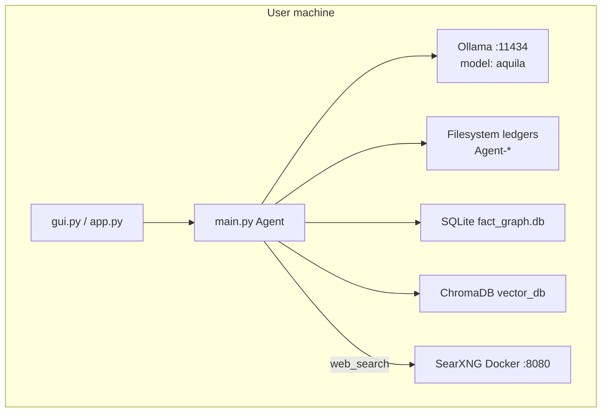
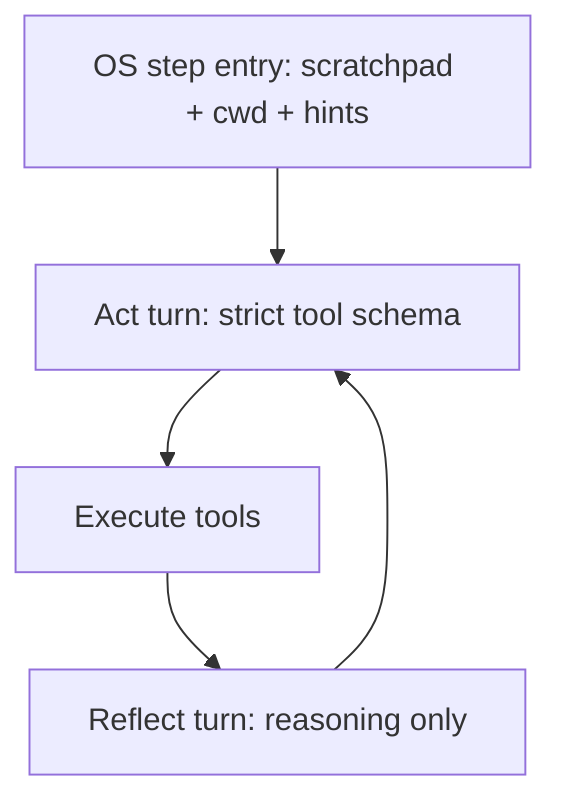
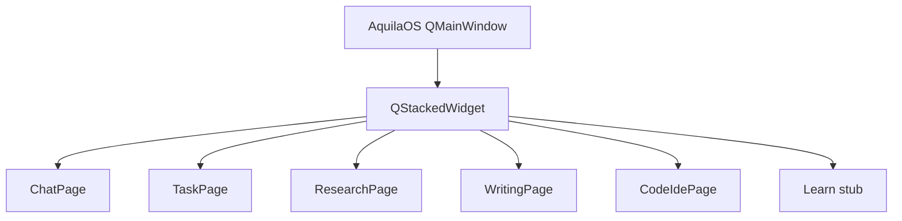

# Aquila OS 3.4 — Codebase Architecture (Detailed)

This repository implements **Aquila OS 3.4**: a **local-first autonomous AI agent** that talks to **Ollama** (custom model `aquila`, based on Qwen 3.5 9B), runs **strict JSON tool-calling**, persists work in **filesystem ledgers**, and uses **dual memory** (SQLite facts + ChromaDB episodic search). The primary UI is a **PySide6 desktop app** with **per-mode workspaces** and **multi-instance** profiles. A legacy **Streamlit** app lives under `agent/legacy/` and is not maintained.

See **[README.md](README.md)** for setup, usage, and release notes. Dependencies are listed in **`requirements.txt`** at the repo root; there is no `pyproject.toml` yet.

---

## 1. Repository layout and responsibilities

```
agent-projects/
├── agent/                    # Entire application (Python package by convention)
│   ├── main.py               # Brain: Agent, OllamaClient, tool loop, sleep cycle
│   ├── gui.py                # Primary UI (PySide6), AgentWorker, ChatSubcallWorker
│   ├── gui_pages/            # Chat, Task, Research, Writing, Code, Home, Learn stub
│   ├── gui_widgets/          # AgentRail, ExecutionLogPanel
│   ├── gui_theme.py          # Global + panel styles
│   ├── gui_state.py          # Ledger HTML renderers
│   ├── loop_engine.py        # Task loop (reflect/act, routing, enrichment)
│   ├── instance_registry.py  # Multi-instance profiles
│   ├── workspace_paths.py    # Canonical Agent-* paths
│   ├── research_journal.py   # Human research notes (GUI)
│   ├── writing_canvas.py     # Markdown ↔ draft buffer
│   ├── tool_catalog.py       # Per-step tool allowlists
│   ├── tools.py              # Core survival tools + security firewall
│   ├── memory.py             # DualMemorySystem
│   ├── prompts.py            # System prompts per operational mode
│   ├── file_parser.py        # Attachment ingestion (images, PDF, DOCX, text)
│   ├── legacy/streamlit_app.py  # Unmaintained alternate UI
│   ├── tool_library/         # Extended tools merged into ALL_TOOLS
│   └── tests/                # pytest suite (~70 modules)
├── start.sh                  # venv + Docker SearXNG + gui.py
├── docker-compose.yml        # SearXNG on :8080
├── searxng-settings.yml      # SearXNG config
├── Modelfile                 # Ollama model definition
├── .env.EXAMPLE              # SMTP template
├── .gitignore
├── spinning_circle_shader.frag  # GLSL shader (unused by Python)
└── test_script.py            # Unrelated hello-world
```

### Runtime directories (repo root only — not under `agent/`)

All durable Aquila state lives at the **repository root** (`agent-projects/`), resolved by [`agent/workspace_paths.py`](agent/workspace_paths.py). Running the GUI or CLI from `agent/` still reads/writes repo-root folders (and `start.sh` `cd`s to the repo root first). Do not create `agent/Agent-*` or `agent/vector_db/` — legacy copies are migrated on startup.

| Path | Role |
|------|------|
| `Agent-Tasks/` | JSON step ledgers for autonomous + writing tasks |
| `Agent-Plans/` | JSON ledgers for **research** mode |
| `Agent-Research/` | Research output `.md` from `final_report` |
| `Agent-Research/.journal/` | Per-instance human research notes (GUI, injectable) |
| `Agent-Creations/` | Task output `.md` from `final_report` |
| `Agent-Drafts/` | Writing-mode draft state + compiled documents |
| `Agent-Logs/` | Per-session execution logs (`RunLogger`) |
| `Agent-Memory/` | SQLite `fact_graph.db` |
| `Agent-Code/` | Code-mode buffer (`active_code_state.json`) + synced project trees |
| `Agent-Instances/` | Per-instance profiles, workspace summaries, conversation archives |
| `vector_db/` | ChromaDB (episodic memory, tool routing, codebase index) |

Override root for tests: `AQUILA_DATA_ROOT=/tmp/...`. Skip one-time migration: `AQUILA_SKIP_MIGRATE=1`.

`.gitignore` excludes `*.env`, `*.db`, `*.md`, `*.json`, `vector_db/`, and most agent output folders — so **on-disk artifacts are local-only**.

---

## 2. External dependencies and deployment topology



### Services

1. **Ollama** — `http://127.0.0.1:11434`, OpenAI-compatible `/v1/chat/completions`, model from `OLLAMA_MODEL` (default `aquila`).
2. **SearXNG** — `docker compose up -d` exposes `http://localhost:8080/search` for `web_search`.
3. **Optional SMTP** — `.env` at repo root or `agent/.env` for `send_email_tool`.

### Model (`Modelfile`)

- Base: `qwen3.5:9b`
- `num_ctx 32768`
- `temperature 0.2` at model level (agent loop often uses 0.1–0.2 for tasks, 0.6 for chat)

Build: `ollama create aquila -f Modelfile`

### Startup (`start.sh`)

1. Activates `ai-agent-env` (Windows: `Scripts/activate`, Unix: `bin/activate`)
2. `docker compose up -d`
3. `python agent/gui.py`

---

## 3. Module dependency graph

```
gui.py
    ├── gui_pages/ (per-mode workspaces)
    ├── gui_widgets/, gui_state.py, gui_theme.py
    └── main.py (get_agent, initiate_sleep_cycle, client)
            ├── memory.py (DualMemorySystem)
            ├── prompts.py
            ├── tools.py (SURVIVAL_TOOLS, is_safe_path)
            └── tool_library/__init__.py → ALL_TOOLS
                    ├── web_tools, coding_tools, agent_tools
                    ├── os_tools, email_tools, writing_tools
file_parser.py ← gui.py (attachments)
agent_tools.py ← gui.py (USER_INPUT_CALLBACK bridge)
```

**Import-time singletons in `main.py`:**

- `aquila_memory = DualMemorySystem()`
- `console = DualLogger()`
- `client = OllamaClient()`
- `global_agent = Agent()` — indexes all tools into Chroma, builds three task prompts + chat prompt inputs

Running `import main` or launching the GUI **always** connects to Ollama and indexes tools.

---

## 4. Operational modes

Aquila exposes **five operational modes** (+ Learn stub in GUI):

| Mode | UI flag | System prompt | Ledger file | Output dirs |
|------|---------|---------------|-------------|-------------|
| **Chat** | `chat` | `get_chat_prompt` | None | N/A (no tools) |
| **Autonomous Task** | `autonomous` / `task` | `get_autonomous_prompt` | `Agent-Tasks/{name}.json` | `Agent-Creations/` |
| **Research** | `research` | `get_research_prompt` | `Agent-Plans/{name}.json` | `Agent-Research/` |
| **Writing** | `writing` | `get_writing_prompt` | `Agent-Tasks/{name}.json` + `Agent-Drafts/active_draft_state.json` | `compile_final_document` → `Agent-Drafts/*.md` |
| **Code** | `code` | `get_code_prompt` | `Agent-Tasks/{name}.json` + `Agent-Code/active_code_state.json` | `sync_project_to_disk` → project tree |
| **Learn** | `learn` | _(none — stub)_ | None | Planned 3.5 |

Inter-modal automation is noted as **“in development”** in prompts; the Task workspace UI reserves a **mode stack** column for future orchestration.

---

## 5. Core runtime: `main.py`

### 5.1 Strict JSON schema (`build_strict_schema`)

For every tool in `executable_tools = SURVIVAL_TOOLS ∪ ALL_TOOLS`, the schema builder:

1. Reads `inspect.signature(func)`
2. Maps each parameter to `{"type": "string"}` (all args treated as strings for the LLM)
3. Marks parameters without defaults as **required**
4. Emits an `anyOf` entry per tool: `{ name: const, arguments: { properties, required, additionalProperties: false } }`

Top-level response shape:

```json
{
  "reasoning": "string",
  "tools": [ { "name": "...", "arguments": { ... } } ],
  "final_report": "optional string"
}
```

This is sent to Ollama as `response_format.type = "json_schema"` with `strict: True`, which is the primary defense against hallucinated tool names and missing arguments.

`AQUILA_ACTION_SCHEMA` is built once at module load from the full merged tool set.

**Routing (3.4):** `LoopEngine._schema_for_step()` builds a strict schema from `tool_catalog.allowed_tools_for_step()` (step kind + mode required tools + cap). `DualMemorySystem.route_tools()` still provides a semantic subset that is unioned with required tools — not the full 30+ tool surface every turn.

### 5.2 `OllamaClient` and inference stack

**Configuration** (optional `.env`):

| Variable | Default | Role |
|----------|---------|------|
| `OLLAMA_BASE_URL` | `http://127.0.0.1:11434` | API base |
| `OLLAMA_MODEL` | `aquila` | Model name (`aquila-tq-32k` / `aquila-tq-64k` / `aquila-tq-96k` with TurboQuant) |
| `OLLAMA_NUM_CTX` | _(unset)_ | If set, sends `options.num_ctx` on each request |

**Modelfiles** at repo root: `Modelfile` (32k baseline), `Modelfile.tq-64k`, `Modelfile.tq-96k`. Context is normally defined in the Modelfile; `OLLAMA_NUM_CTX` overrides at runtime for experiments.

**TurboQuant** (optional): Ollama server started via `scripts/ollama-serve-turboquant.ps1` sets `OLLAMA_KV_CACHE_TYPE=tq3` (and related flags) to compress the KV cache so longer `num_ctx` fits in VRAM. See **[docs/ollama-turboquant.md](docs/ollama-turboquant.md)**. Aquila does not start Ollama; it only calls the API.

### Context budget and web enrichment (3.3)

| Module | Role |
|--------|------|
| `agent/context_budget.py` | Detects effective `num_ctx` from `OLLAMA_NUM_CTX` / model name; maps to tiers (`compact` → `max`) and limits (auto-scrape count, scrape char cap, scratchpad bytes, file preview, tree cap). |
| `agent/web_enrichment.py` | After `web_search` in `LoopEngine`, ranks URLs (`.edu`/`.gov` preferred), auto-scrapes top N (1/2/3 by tier), registers sources in `SourceRegistry`. |
| Research deliverables | `save_task_deliverable` appends OS-generated **References** from `SourceRegistry` for `mode=research`. |

Env: `AQUILA_AUTO_SCRAPE`, `AQUILA_CONTEXT_TIER` (see `.env.EXAMPLE`).

**Client behavior:**

- POST `{base_url}/v1/chat/completions`
- Payload: `model`, `messages`, `temperature`, `stream`, `frequency_penalty` / `presence_penalty` (0.2), optional `options.num_ctx`
- On init: warns if `OLLAMA_MODEL` is missing from `/api/tags`
- **Streaming:** SSE `data:` lines; yields `{"message": {"content": token}}`
- **Kill switch:** If no chunk progress for `timeout` seconds (default 120) during streaming, closes response and yields severed note
- **Non-streaming:** Returns full `{"message": {"content": ...}}`

### 5.3 `parse_agent_response`

Multi-stage recovery for model output:

1. Strip markdown fences (`` ```json ``)
2. `json.loads` with `strict=False`
3. Fallback: `ast.literal_eval` after normalizing `true`/`false`/`null`
4. **JSON healer:** Truncate trailing junk, close open strings/brackets/stacks

Used after every agent iteration in `run_unified_task`.

### 5.4 `ToolExecutor`

For each tool call:

- Rejects unknown tool names
- Filters arguments to signature parameters (unless function accepts `**kwargs`)
- Catches exceptions and returns string errors to the model

**Special tools** bypass normal execution in `run_unified_task`:

- `mark_objective_complete` — advances ledger, clears `conversation_history`
- `finish_task` — `store_experience`, returns user message

### 5.5 JSON ledger state machine

**Planner:** `Agent.generate_plan()` (there is no separate `behavior_planner.py` file)

- Up to 3 attempts
- Uses **JSON prefill**: assistant message starts with `` ```json\n{\n  "status": "in_progress",\n  "current_step_index": 0,\n  "steps": [`` and model completes the rest
- Research vs task wording differs; both produce:

```json
{
  "status": "in_progress",
  "current_step_index": 0,
  "steps": [
    { "description": "...", "status": "pending", "max_iterations": N }
  ]
}
```

Helpers:

- `initialize_json_ledger` — write fresh state
- `read_json_state` — load
- `advance_json_state` — mark step complete, bump index, set `status: completed` when done

**Executor loop:** `Agent.run_unified_task`

```
while step_count < 50:
  if cancel_check(): abort
  if ledger.status == "completed": return success
  load current objective + max_iterations for this step
  build user message with ultimate goal + current objective
  if step_attempts >= max_iterations: OS override (finish or mark complete)
  messages = [system_prompt] + conversation_history + [user_msg]
  prefill assistant with ```json\n{\n  "reasoning": "
  stream LLM with AQUILA_ACTION_SCHEMA
  parse JSON → execute tools
  if mark_objective_complete: advance_json_state; conversation_history = []
  if finish_task: store_experience; return message
  append tool outputs as user role "Tool Outputs:..."
  step_count += 1
```

**Memory wipe on step advance:** When the model calls `mark_objective_complete`, `conversation_history` is reset to `[]`. Continuity is expected via `save_research_note` / `read_all_research_notes` and scratchpad — enforced in prompts (“First Step Rule”).

**Per-step iteration cap:** Each step has `max_iterations` (planner-assigned). The loop counts assistant messages in `conversation_history` for the current step; when exceeded, injects a **CRITICAL OS OVERRIDE** string forcing `finish_task` (last step) or `mark_objective_complete` (earlier steps).

**Global cap:** 50 outer `step_count` iterations across the whole task.

**`final_report`:** If present in parsed JSON, written to `Agent-Research/{task_name}.md` or `Agent-Creations/{task_name}.md` depending on mode.

### 5.6 Chat mode (`Agent.run_chat`)

- No JSON schema, no tool loop
- System prompt: `get_chat_prompt(get_all_facts(), recall_experiences(user_input, n=2))`
- Supports multimodal user content: `image_url` with base64 JPEG
- Streams at temperature 0.6

### 5.7 Sleep cycle (`initiate_sleep_cycle`)

- Scans **`Agent-Tasks/*.json`** and **`Agent-Plans/*.json`**
- For each file: LLM summarizes JSON (truncated if huge) → `store_experience` → delete JSON
- Returns markdown report for UI

This is the **offline consolidation** path: unfinished task ledgers become episodic memories.

### 5.8 Logging (`DualLogger`)

- On `set_task(task_name)`: creates `Agent-Logs/{task_name}_{timestamp}.log`
- Mirrors `rich` console output to file (strip markup)
- Logs iterations and tool executions

---

## 6. Security model (`tools.py`)

Central gate: `is_safe_path(path_obj)`

**Blocked:**

- Files: `.env`, `state.json`, `.gitignore`, `chroma.sqlite3`
- Extensions: `.pem`, `.key`, `.log`, `.db`, `.sqlite3`
- Path segments: `Agent-Logs`, `vector_db`, `__pycache__`, `.git`

**Additional rules:**

- `write_file` cannot write under `Agent-Tasks/` (ledger integrity)
- `list_directory` skips forbidden dir names
- `get_directory_tree` ignores `.git`, `venv`, `ai-agent-env`, `vector_db`, etc.
- `read_file` capped at **1500 characters** with hint to use `read_file_lines` / `search_in_file`

**Python writes:** After save, optional `flake8` + `ast.parse`; syntax errors return actionable hints to use `replace_in_file`.

**Process control (`manage_process`):** Requires terminal `y/n` approval; allowlisted apps only (Chrome, Notepad).

**Env vars (`get_env_variables`):** Masks values containing `KEY`, `SECRET`, `PASS`, `TOKEN`.

---

## 7. Memory architecture (`memory.py`)

### 7.1 SQLite (`Agent-Memory/fact_graph.db`)

| Table | Purpose | API |
|-------|---------|-----|
| `facts` | Permanent user preferences / lore | `store_fact`, `get_all_facts` |
| `scratchpad` | Per-task research notes | `save_scratchpad_note`, `get_scratchpad_notes` |

### 7.2 ChromaDB (`vector_db/` at repo root)

| Collection | Purpose | API |
|------------|---------|-----|
| `episodic_experiences` | Completed task summaries | `store_experience`, `recall_experiences` |
| `agent_tools` | Tool name + description embeddings | `index_tools`, `route_tools` (unused in loop) |

### 7.3 Code search (`coding_tools.py`)

Separate Chroma collection `codebase` with **SentenceTransformer** `all-MiniLM-L6-v2`:

- `_index_codebase` walks `.py` files, splits on `\n\n`, re-indexes on each `semantic_code_search` call
- `replace_function` does indentation-based textual splice, then auto-runs `test_python_script`
- `test_python_script` runs flake8 + executes script

**Important:** `agent_tools.py` may instantiate its **own** `DualMemorySystem()` — separate from `main.aquila_memory` for facts/scratchpad. Both resolve storage via `workspace_paths` (`Agent-Memory/`, `vector_db/` at repo root), so cwd no longer affects which database files are opened.

---

## 8. Tool catalog (33 tools)

### 8.1 Survival tools (`tools.py` → `SURVIVAL_TOOLS`)

| Tool | Behavior |
|------|----------|
| `read_file` | UTF-8 read, 1500 char cap, security gate |
| `read_file_lines` | Numbered line range |
| `write_file` | Create/overwrite; strip markdown fences; block Agent-Tasks; lint `.py` |
| `replace_in_file` | Exact substring replace; syntax check hint |
| `list_directory` | `[DIR]` / `[FILE]` listing |
| `get_directory_tree` | ASCII tree, depth limit; char cap from context tier |
| `search_tool_library` | Keyword search over `ALL_TOOLS` metadata |
| `mark_objective_complete` | Handled in Agent (not ToolExecutor) |
| `finish_task` | Handled in Agent |

### 8.2 Web (`web_tools.py`)

| Tool | Behavior |
|------|----------|
| `web_search` | SearXNG JSON API; engines google,bing,duckduckgo,wikipedia; OS auto-scrapes top URL(s) after each call in task loop |
| `read_webpage` | cloudscraper + BeautifulSoup → markdownify; PDF via PyMuPDF; truncate cap from context tier |

### 8.3 Coding (`coding_tools.py`)

| Tool | Behavior |
|------|----------|
| `_index_codebase` | Internal indexer (still in registry) |
| `semantic_code_search` | Re-index + query top 2 chunks |
| `replace_function` | Replace function body by name |
| `test_python_script` | flake8 + run |

### 8.4 Agent / memory (`agent_tools.py`)

| Tool | Behavior |
|------|----------|
| `query_past_experience` | Chroma episodic search |
| `ask_user` | Blocks on `USER_INPUT_CALLBACK` (GUI sets this) |
| `store_fact` | SQLite fact |
| `save_research_note` | Scratchpad row; byte cap from context tier |
| `read_all_research_notes` | Compile scratchpad for task |

### 8.5 OS (`os_tools.py`)

| Tool | Behavior |
|------|----------|
| `search_in_file` | Case-insensitive grep, max 50 lines |
| `search_files` | fnmatch walk, skip forbidden dirs |
| `delete_file`, `rename_file`, `move_file` | Guarded by `is_safe_path` |
| `create_directory` | mkdir parents |
| `manage_process` | start/stop allowlisted; user approval |
| `get_env_variables` | List or fetch; redact secrets |

### 8.6 Email (`email_tools.py`)

| Tool | Behavior |
|------|----------|
| `send_email_tool` | `EmailSender` SMTP; flexible kwargs aliases for to/body/cc/attachments |

### 8.7 Writing (`writing_tools.py`)

| Tool | Behavior |
|------|----------|
| `init_document` | Create `Agent-Drafts/active_draft_state.json` |
| `write_section` | Append or overwrite section by header |
| `read_outline` | List section headers |
| `compile_final_document` | Write final `.md`, remove active draft file |

Writing mode **forbids** `write_file` for document body (prompt-level); must use writing toolkit.

---

## 9. Prompt system (`prompts.py`)

Shared `get_base_context(tool_docs)` injects:

- Date, platform, cwd
- `MODES_ROSTER`
- Full tool list (built at `Agent.__init__` from signatures + first line of docstrings)
- Strict JSON formatting rules (single-line strings, `\n`, escaped quotes, no nested JSON in scratchpad)

Mode-specific rules:

- **Autonomous:** max 6 tools per turn; must `save_research_note` before `mark_objective_complete`; `finish_task` on final step with `final_report`
- **Research:** web focus; `final_report` + `finish_task` on last step; anti–data-spiral instructions
- **Writing:** draft buffer lifecycle; `compile_final_document` on finalize; never dump full doc into `final_report`
- **Code:** TDD canvas tools, project scope, recon policy; pytest/flake8 on verify steps
- **Chat:** natural language; inject facts + episodic memory; explicitly deny “no memory”
- **Research:** honors `--- HUMAN RESEARCH NOTES ---` when injected from GUI journal

---

## 10. UI layers

### 10.1 Desktop GUI (`gui.py`) — primary

**Shell:** `QMainWindow` with `main_stack`: **Home** (`home_page.py`) → **Workspace** (mode combo + `page_stack`).

| Page | Module | Layout summary |
|------|--------|----------------|
| Home | `home_page.py` | Instance list, create/open |
| Chat | `chat_page.py` | `AgentRail` only |
| Task | `task_page.py` | Rail + plan list + preview + log/tracker |
| Research | `research_page.py` | Rail + SearXNG search/reader + journal + log/tracker |
| Writing | `writing_page.py` | Home (doc list) ↔ Canvas (markdown + preview + rail) |
| Code | `code_ide_page.py` | Toolbar, tree, **editable** tabs, rail, patches, lint/pytest strip |
| Learn | `stub_page.py` | Placeholder (3.5) |

Shared: [`gui_widgets/agent_rail.py`](agent/gui_widgets/agent_rail.py), [`execution_log_panel.py`](agent/gui_widgets/execution_log_panel.py), [`gui_formatting.py`](agent/gui_formatting.py), [`gui_richtext.py`](agent/gui_richtext.py) (`SmartScrollTextEdit`, stream finalize).

**Threads:**

- `AgentWorker` — `run_chat` or `run_unified_task`; signals `ledger_signal`, `finished_signal`, `ask_user_signal`
- `ChatSubcallWorker` — one-shot `run_chat` for selection edits (Writing/Code)
- `SleepWorker` — `initiate_sleep_cycle`

**Task execution:** `execute_task()` builds `text_chunks` from attachments + `page.get_extra_text_chunks()` (e.g. research journal). `chat_finished` vs `task_finished` avoid duplicate chat bubbles.

**Resume:** Scans `Agent-Tasks/` and `Agent-Plans/`; code buffer shows as `[code] {project_name}`.

**State refresh:** `resolve_ledger_path()` in `gui_state.py` picks `Agent-Plans/` for research, draft JSON for writing, code buffer for code.

**`ask_user`:** `agent_tools.USER_INPUT_CALLBACK` → `QInputDialog` + `threading.Event`.

**Themes:** `gui_theme.main_window_stylesheet()` + per-panel `apply_panel_style`.

See **§18** for workspace diagram and module map. Manual QA: [`docs/workspace-qa-3.4.md`](docs/workspace-qa-3.4.md).

### 10.2 Streamlit (`legacy/streamlit_app.py`) — unmaintained

Legacy 3.1 UI; not updated for 3.4 workspaces, instances, or writing/code modes. Use `gui.py`.

---

## 11. Attachment pipeline (`file_parser.py`)

For each file path:

| Type | Handling |
|------|----------|
| Images | base64 → `image_payloads` |
| PDF | PyMuPDF text extraction |
| DOCX | python-docx paragraphs + table rows |
| Other | UTF-8 decode with replacement |

Combined text chunked at **90,000** characters per chunk. `format_attachment_context()` in `main.py` merges **all** chunks (tier-capped) for planner and first loop turn. Research journal text is re-injected on **each** step via `LoopEngine.human_research_notes` in `_build_step_entry_messages()`.

---

## 12. End-to-end data flows

### Autonomous task (desktop)

```
User prompt + mode
  → task_name = sanitized_prefix + timestamp
  → AgentWorker.run()
  → run_unified_task(task_name, prompt, mode, ui_callback=ledger_signal)
       → if no JSON: generate_plan → write Agent-Tasks/ or Agent-Plans/
       → loop: strict JSON stream → parse → ToolExecutor / advance / finish
       → ledger_signal updates Execution Log
  → finished_signal → markdown bubble in chat history
```

### Chat

```
User prompt (+ optional images)
  → run_chat → Ollama stream
  → tokens → stream_chat_token
  → finished_signal → full text (no checkmark prefix)
```

### Sleep cycle

```
SleepWorker → initiate_sleep_cycle
  → foreach Agent-Tasks/*.json: summarize → episodic memory → delete file
  → UI markdown system message
```

---

## 13. Testing (`agent/tests/`)

**Framework:** pytest + pytest-qt for GUI.

| Area | Test files (examples) |
|------|------------------------|
| Loop / planner | `test_loop_guards.py`, `test_plan_validator.py`, `test_run_unified_task.py` |
| Tool routing | `test_tool_catalog.py`, `test_tool_policy.py` |
| Code canvas | `test_code_canvas_tools.py`, `test_pending_patches.py`, `test_code_user_edit.py` |
| Research | `test_research_deliverable.py`, `test_research_journal.py`, `test_web_enrichment.py` |
| Writing | `test_writing_tools.py`, `test_writing_canvas.py` |
| Instances / memory | `test_instance_registry.py`, `test_memory_instance_scope.py`, `test_memory_tool_isolation.py` |
| GUI / workspaces | `test_gui.py`, `test_gui_*_page.py`, `test_gui_state_tracker.py`, `test_gui_formatting.py`, `test_gui_smart_scroll.py` |
| Live Ollama | `test_live_ollama.py`, `test_live_context_smoke.py` (marker `live`) |

Run from `agent/`: `pytest tests/ -q`. See README § Testing. Manual checklist: `docs/workspace-qa-3.4.md`.

**Gaps:** No automated SearXNG integration tests; Streamlit unmaintained; live tests require local Ollama.

---

## 14. Inferred Python dependencies

| Package | Use |
|---------|-----|
| `requests` | Ollama, SearXNG |
| `rich` | Console/logging |
| `python-dotenv` | `.env` |
| `chromadb` | Vector stores |
| `sentence-transformers` (via Chroma EF) | Code embeddings |
| `beautifulsoup4`, `markdownify`, `cloudscraper` | Web |
| `PyMuPDF` (`fitz`) | PDF |
| `python-docx` | DOCX |
| `psutil` | Processes |
| `PySide6` | Desktop GUI |
| `streamlit` | Web UI |
| `markdown` | GUI rendering |
| `pytest`, `pytest-qt` | Tests |
| `flake8` | Optional lint |

---

## 15. Design patterns and philosophy

1. **Local-first** — No cloud LLM in the core path; private search via SearXNG.
2. **Constrained decoding** — Dynamic strict JSON schema from function signatures.
3. **Filesystem as source of truth for multi-step work** — JSON ledgers survive restarts and UI disconnects.
4. **Intentional amnesia between steps** — Forces scratchpad discipline and reduces context bloat.
5. **Prefill completion** — Planner and agent turns start partial JSON to steer the model.
6. **Defense in depth** — Schema + path firewall + blocked ledger edits + process allowlists.
7. **Single brain, multiple faces** — `global_agent` shared by Qt and Streamlit.
8. **Tool surface vs. discovery** — All tools in schema always; `search_tool_library` helps the model learn formats; semantic `route_tools` prepared but not active.

---

## 16. Aquila OS 3.3 — Loop and planner

### Planner (`plan_validator.py`)

- Each step includes `step_kind` (`search`, `read`, `code`, `verify`, `synthesize`, `write`, `finalize`) and `max_iterations` tuned via **BUDGET_RUBRIC** (min/default/max per kind).
- `validate_and_tune_plan()` runs after `generate_plan()`; caps at 8 steps and total budget 60.
- Research plans with fewer than 4 steps are auto-expanded via `expand_research_plan()` (search → read → synthesize → finalize). When an explore brief already ran, the template starts at search.
- Open-ended catalog requests should scope to a representative sample + data-source table, not exhaustive row-by-row coverage.

### Execution loop (`loop_engine.py`)



- **Continuous loop (3.4):** After tool results, the agent continues on the same act schema (reasoning + tools). Episode budget counts toolful turns per plan step. Legacy act/reflect: `AQUILA_LEGACY_ACT_REFLECT=1`.
- **Budget:** Parse/schema failures pop the assistant message (do not burn `step_attempts`). Grace +2 iterations once per step if tools succeeded.
- **Step entry:** Scratchpad notes, `WORKSPACE_ROOT`, and `step_kind` hints injected without an LLM call.
- **Hardening:** `validate_tool_arguments()`, `save_research_note` 8KB cap, `normalize_workspace_path()` for doubled `agent/agent` paths.
- **Code recon (3.4):** [`recon_policy.py`](f:/Users/myfri/agent-projects/agent/recon_policy.py) pins `get_directory_tree` / `read_code_outline` on code explore/read; [`path_visit_registry.py`](f:/Users/myfri/agent-projects/agent/path_visit_registry.py) blocks excessive `list_directory`; explore advance gate accepts tree+read; Chroma routing uses USE WHEN blurbs.
- **Final-step stall:** `AQUILA_FINAL_STEP_STALL_LIMIT` (default 8) counts only act turns with tools on the last step. Stall 6 nudges `finish_task`; stall limit saves a partial report via `save_task_deliverable`.
- **Duplicate tools:** Identical tool signatures warn twice, then hard-block on the third call (signatures are not cleared after a warning).
- **Context (max tier):** Proactive in-step compression at 70% of `in_step_token_cap` before each LLM call.

`Agent.run_unified_task` delegates to `LoopEngine.run()`.

---

## 17. Aquila OS 3.3 — Code Canvas

### Dual ledger (same pattern as Writing 3.2)

| Ledger | Path | Role |
|--------|------|------|
| Execution | `Agent-Tasks/{task}.json` | Planner steps, `step_kind`, budgets |
| Code buffer | `Agent-Code/active_code_state.json` | In-memory project: files, lint/test status, dirty flags |

Authoritative edits in Code Mode go through **code canvas tools** (`init_code_project`, `replace_lines`, `apply_unified_patch`, `sync_project_to_disk`). Autonomous Task keeps generic `write_file`.

### Language support (v1)

| Language | Lint | Tests |
|----------|------|-------|
| Python | flake8 (or ast-only fallback) | **pytest** via `run_pytest` |
| JS/TS, Rust, Go | eslint / tsc / cargo clippy / go vet when installed | read/write + search only |

`language_registry.py` dispatches `run_linter` / `run_tests`.

### TDD planner step kinds

`plan_validator.py` adds `tdd_red`, `tdd_green`, `tdd_refactor`. Code Mode plans for “implement / build / feature” intents should follow: explore → red → green → (refactor) → verify → finalize.

`loop_engine.py` soft-gates `mark_objective_complete` on `tdd_red` / `tdd_green` until recent `run_pytest` output shows failure / pass respectively.

### GUI

- Mode selector: **Code Mode** (`mode_flag = "code"`).
- **Editable** `QPlainTextEdit` tabs; debounced `apply_user_buffer_edit` on change; **Save buffer** / **Sync to disk** toolbar.
- File tree click switches tabs; pending patch Accept/Reject with warning if user edited the same file.
- Tracker: `render_code_canvas_html()` — file tree, lint icons, pytest status, current `step_kind`.
- Resume: orphan `active_code_state.json` appears as `[code] {project_name}`.
- Selection → **chat subcall** for quick refactors (same pattern as Writing canvas).

---

## 18. Mode-specific GUI shells (3.4)



| Module | Role |
|--------|------|
| [`agent/gui.py`](agent/gui.py) | Mode selector, `AgentWorker`, `ChatSubcallWorker`, routes signals to active page |
| [`agent/gui_pages/`](agent/gui_pages/) | Per-mode layouts (`BaseModePage` hooks) |
| [`agent/gui_widgets/`](agent/gui_widgets/) | Shared `AgentRail`, `ExecutionLogPanel` |
| [`agent/gui_theme.py`](agent/gui_theme.py) | Stylesheets and mode accent tokens |
| [`agent/gui_state.py`](agent/gui_state.py) | Ledger HTML renderers |
| [`agent/research_journal.py`](agent/research_journal.py) | Human journal files + injection formatting |
| [`agent/writing_canvas.py`](agent/writing_canvas.py) | Markdown canvas ↔ `active_draft_state.json` |

**Research** (`research_page.py`): SearXNG JSON search UI, reader tab, per-instance journal under `Agent-Research/.journal/`, re-injected each research step via `LoopEngine.human_research_notes`.

**Writing** (`writing_page.py`): Home lists compiled `Agent-Drafts/*.md`; canvas with preview; selection edits via chat subcall; structural tasks via writing loop.

**Task** (`task_page.py`): Plan list + future mode-stack placeholder; generic output preview.

**Code IDE** (`code_ide_page.py`): Editable `QPlainTextEdit` tabs, `apply_user_buffer_edit`, tree→tab navigation, patch conflict warning.

**Future:** Learn (LMS-style) — **3.5**.

---

## 18b. Aquila OS 3.4 — Instances and context policy

| Component | Role |
|-----------|------|
| [`instance_registry.py`](agent/instance_registry.py) | `AquilaInstance` profiles under `Agent-Instances/{id}/`; `active.json` tracks selection |
| [`memory_singleton.py`](agent/memory_singleton.py) | `get_memory(instance_id)` — scratchpad keys `{instance_id}::{task}`, episodic metadata filter |
| [`context_manager.py`](agent/context_manager.py) | Tiered step advance: summarize → workspace summary; retain N tool turns at `standard`+ |
| [`context_budget.py`](agent/context_budget.py) | `ContextProfile` adds `keep_turns_on_advance`, `routed_tool_cap`, `workspace_summary_max_chars` |
| [`tool_policy.py`](agent/tool_policy.py) | `explore` read-only allowlist; per-`step_kind` filters |
| [`explore_agent.py`](agent/explore_agent.py) | Optional pre-plan brief (`extended`/`max` tier) for code/research |
| [`gui_pages/home_page.py`](agent/gui_pages/home_page.py) | Instance picker before workspaces |
| Code diff review | `pending_patches` in `active_code_state.json`; Code IDE Accept/Reject (`AQUILA_DIFF_REVIEW`) |
| Terminal | [`shell_tools.py`](agent/tool_library/shell_tools.py) — `run_terminal_command` when `AQUILA_TERMINAL=1` |
| MCP | [`mcp_bridge.py`](agent/mcp_bridge.py) — stub for 4.0 |

**Loop changes:** `LoopEngine` uses `generation_start` for stream kill switch, `build_loop_messages()`, routed schema via `route_tools`, `explore` advance gate.

### Research reliability (96k / long runs)

| Component | Role |
|-----------|------|
| [`url_visit_registry.py`](agent/url_visit_registry.py) | Per-run URL tracking; hard-blocks repeat `read_webpage` and paywall revisits |
| [`web_content_quality.py`](agent/web_content_quality.py) | Paywall/thin-page heuristics before content enters context |
| [`timeout_policy.py`](agent/timeout_policy.py) | `compute_read_timeout()` scales with estimated prompt tokens + tier (`AQUILA_READ_TIMEOUT_MAX`) |
| [`run_logger.py`](agent/run_logger.py) | Truncated `Agent-Logs/*.log` + optional `*.jsonl` (`AQUILA_LOG_JSON`) |
| `ContextProfile.max_scrape_chars_per_turn` | Max tier: 60k chars total auto-scrape per act turn |

On VRAM/read timeout at high context, the loop may run one in-step compress + retry (`AQUILA_TIMEOUT_COMPRESS_RETRY`) instead of schema-retry storms.

---

## 19. Extension points and rough edges

| Item | Status (3.4) |
|------|----------------|
| `route_tools(objective)` | Wired per-step in `LoopEngine._schema_for_step` with required-tool union |
| Inter-modal automation | Prompt says “in development” |
| Streamlit (`legacy/streamlit_app.py`) | Legacy 3.1 artifact; not maintained |
| Task State Tracker | `gui_state`: autonomous, research, writing, **code** (`render_code_canvas_html`) |
| Code Mode | `code_canvas_tools.py`, `language_registry.py`, `gui_pages/code_ide_page.py` |
| Mode workspaces | `gui_pages/` + `QStackedWidget` in `gui.py` (3.4) |
| Memory | `get_memory(instance_id)` per instance; `aquila_memory` alias for `default` |
| `_index_codebase` | Excluded from strict schema / executable tools |
| Dependencies | `requirements.txt` at repo root |
| Chat double-bubble | Fixed: `chat_finished` vs `task_finished` in `gui.py` |
| Attachment injection | Multi-chunk `format_attachment_context`; planner + first loop turn |
| Research journal | `Agent-Research/.journal/`; per-step via `human_research_notes` |
| Writing canvas GUI | `writing_canvas.py`; home + canvas in `writing_page.py` |
| Chat subcall | `ChatSubcallWorker` for selection edits |
| Loop engine | `loop_engine.py`: reflect/act, grace budget, step entry ritual |
| Planner tuning | `plan_validator.py` after `generate_plan` |
| Loop guards | Max 6 tools/turn, parse pop (no budget burn), smart override before force advance |
| Tests | 260+ tests (unit + GUI + live Ollama) in `agent/tests/`; run `pytest` from `agent/` |
| Ledger on `finish_task` | `complete_ledger_state()` marks all steps + status completed |
| Research deliverables | `save_task_deliverable()` → `Agent-Research/{task}.md` (top-level or `finish_task` args) |
| Sleep cycle | Consolidates `Agent-Tasks/` and `Agent-Plans/` |
| Chat clear | GUI **Clear Chat View** wipes display only; keeps `_chat_history_messages` |
| `spinning_circle_shader.frag` | Orphan asset |

---

## 20. Quick reference: key files to read first

| Question | Start here |
|----------|------------|
| How does the agent loop work? | `agent/loop_engine.py`, `agent/main.py` — `run_unified_task`, `generate_plan` |
| Planner budgets? | `agent/plan_validator.py` |
| How are tools registered? | `agent/tools.py`, `agent/tool_library/__init__.py` |
| How is memory stored? | `agent/memory.py` |
| What does the model see? | `agent/prompts.py` |
| How do I run it? | `start.sh`, `agent/gui.py` |
| What’s tested? | `agent/tests/` |

---

This is a **single-package autonomous agent framework**: Ollama for inference, a merged tool registry with strict JSON calling and per-step routing, file-based step ledgers for long tasks, dual memory for chat and consolidation, multi-instance isolation, and a PySide6 workspace shell as the intended daily driver.