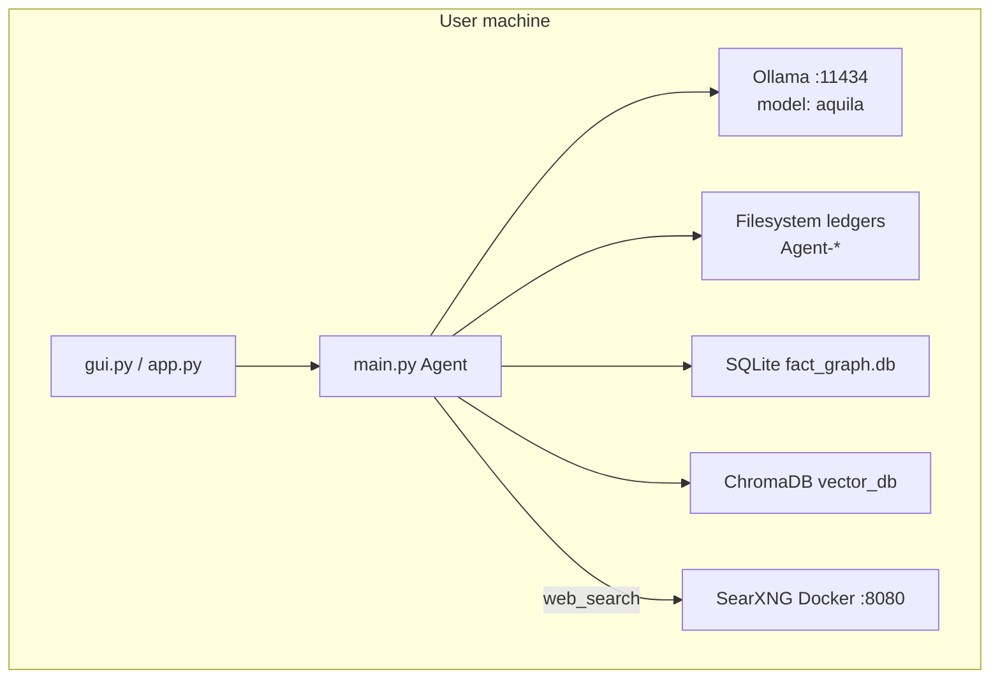
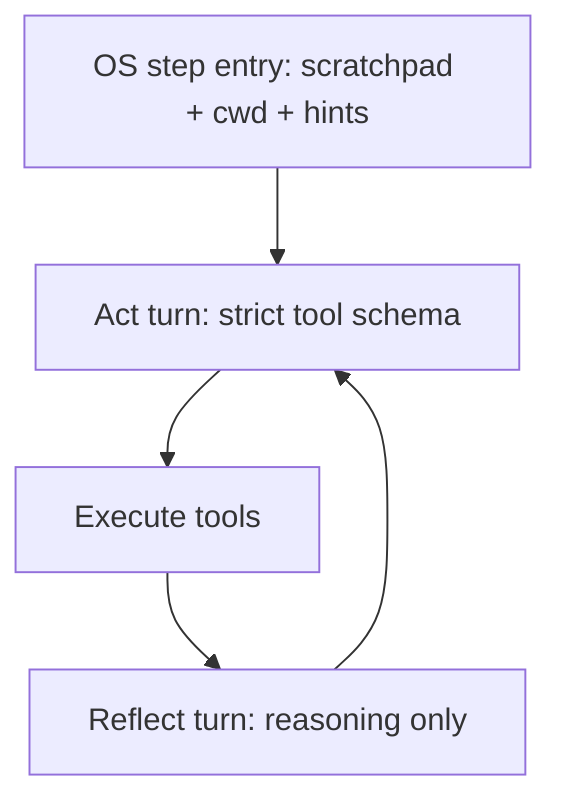

# Aquila OS 3.2 — Codebase Architecture (Detailed)

This repository implements **Aquila OS 3.2**: a **local-first autonomous AI agent** that talks to **Ollama** (custom model `aquila`, based on Qwen 3.5 9B), runs **strict JSON tool-calling**, persists work in **filesystem ledgers**, and uses **dual memory** (SQLite facts + ChromaDB episodic search). The primary UI is a **PySide6 desktop app**; a **Streamlit** web UI exists as an alternate front end.

See **[README.md](README.md)** for setup, usage, and release notes. Dependencies are listed in **`requirements.txt`** at the repo root; there is no `pyproject.toml` yet.

---

## 1. Repository layout and responsibilities

```
agent-projects/
├── agent/                    # Entire application (Python package by convention)
│   ├── main.py               # Brain: Agent, OllamaClient, tool loop, sleep cycle
│   ├── gui.py                # Primary UI (PySide6)
│   ├── app.py                # Alternate UI (Streamlit)
│   ├── tools.py              # Core survival tools + security firewall
│   ├── memory.py             # DualMemorySystem
│   ├── prompts.py            # System prompts per operational mode
│   ├── file_parser.py        # Attachment ingestion (images, PDF, DOCX, text)
│   ├── test_schema.py        # Dev utility: dump JSON schema
│   ├── tool_library/         # Extended tools merged into ALL_TOOLS
│   └── tests/                # pytest suite (22 modules)
├── start.sh                  # venv + Docker SearXNG + gui.py
├── docker-compose.yml        # SearXNG on :8080
├── searxng-settings.yml      # SearXNG config
├── Modelfile                 # Ollama model definition
├── .env.EXAMPLE              # SMTP template
├── .gitignore
├── spinning_circle_shader.frag  # GLSL shader (unused by Python)
└── test_script.py            # Unrelated hello-world
```

### Runtime directories (created at use, mostly gitignored)

| Path | Role |
|------|------|
| `Agent-Tasks/` | JSON step ledgers for autonomous + writing tasks |
| `Agent-Plans/` | JSON ledgers for **research** mode |
| `Agent-Research/` | Research output `.md` from `final_report` |
| `Agent-Creations/` | Task output `.md` from `final_report` |
| `Agent-Drafts/` | Writing-mode draft state + compiled documents |
| `Agent-Logs/` | Per-session execution logs (`DualLogger`) |
| `Agent-Memory/` | SQLite `fact_graph.db` |
| `agent/vector_db/` | ChromaDB persistence (episodic, tools, codebase) |

`.gitignore` excludes `*.env`, `*.db`, `*.md`, `*.json`, `vector_db/`, and most agent output folders — so **on-disk artifacts are local-only**.

---

## 2. External dependencies and deployment topology



### Services

1. **Ollama** — `http://127.0.0.1:11434`, OpenAI-compatible `/v1/chat/completions`, model name hardcoded as `"aquila"`.
2. **SearXNG** — `docker compose up -d` exposes `http://localhost:8080/search` for `web_search`.
3. **Optional SMTP** — `.env` at repo root or `agent/.env` for `send_email_tool`.

### Model (`Modelfile`)

- Base: `qwen3.5:9b`
- `num_ctx 32768`
- `temperature 0.2` at model level (agent loop often uses 0.1–0.2 for tasks, 0.6 for chat)

Build: `ollama create aquila -f Modelfile`

### Startup (`start.sh`)

1. Activates `ai-agent-env` (Windows: `Scripts/activate`, Unix: `bin/activate`)
2. `docker compose up -d`
3. `python agent/gui.py`

---

## 3. Module dependency graph

```
gui.py / app.py
    └── main.py (global_agent, initiate_sleep_cycle, client)
            ├── memory.py (DualMemorySystem)
            ├── prompts.py
            ├── tools.py (SURVIVAL_TOOLS, is_safe_path)
            └── tool_library/__init__.py → ALL_TOOLS
                    ├── web_tools, coding_tools, agent_tools
                    ├── os_tools, email_tools, writing_tools
file_parser.py ← gui.py (attachments)
agent_tools.py ← gui.py (USER_INPUT_CALLBACK bridge)
```

**Import-time singletons in `main.py`:**

- `aquila_memory = DualMemorySystem()`
- `console = DualLogger()`
- `client = OllamaClient()`
- `global_agent = Agent()` — indexes all tools into Chroma, builds three task prompts + chat prompt inputs

Running `import main` or launching the GUI **always** connects to Ollama and indexes tools.

---

## 4. Operational modes

Aquila exposes **four cognitive modes** (documented in `prompts.py` as `MODES_ROSTER`):

| Mode | UI flag | System prompt | Ledger file | Output dirs |
|------|---------|---------------|-------------|-------------|
| **Chat** | `chat` | `get_chat_prompt` | None | N/A (no tools) |
| **Autonomous Task** | `autonomous` / `task` | `get_autonomous_prompt` | `Agent-Tasks/{name}.json` | `Agent-Creations/` |
| **Research** | `research` | `get_research_prompt` | `Agent-Plans/{name}.json` | `Agent-Research/` |
| **Writing** | `writing` | `get_writing_prompt` | `Agent-Tasks/{name}.json` + `Agent-Drafts/active_draft_state.json` | Draft compile → markdown file |

**Streamlit `app.py`** only exposes Chat, Autonomous Task, and Research — **not Writing**.

Inter-modal automation is explicitly noted as **“in development”** in prompts; the agent is instructed to advise the user which mode to use.

---

## 5. Core runtime: `main.py`

### 5.1 Strict JSON schema (`build_strict_schema`)

For every tool in `executable_tools = SURVIVAL_TOOLS ∪ ALL_TOOLS`, the schema builder:

1. Reads `inspect.signature(func)`
2. Maps each parameter to `{"type": "string"}` (all args treated as strings for the LLM)
3. Marks parameters without defaults as **required**
4. Emits an `anyOf` entry per tool: `{ name: const, arguments: { properties, required, additionalProperties: false } }`

Top-level response shape:

```json
{
  "reasoning": "string",
  "tools": [ { "name": "...", "arguments": { ... } } ],
  "final_report": "optional string"
}
```

This is sent to Ollama as `response_format.type = "json_schema"` with `strict: True`, which is the primary defense against hallucinated tool names and missing arguments.

`AQUILA_ACTION_SCHEMA` is built once at module load from the full merged tool set.

**Note:** `DualMemorySystem.route_tools()` can semantically subset tools, but **the production loop always passes the full schema** — semantic routing is implemented but not wired in.

### 5.2 `OllamaClient`

- POST `{base_url}/v1/chat/completions`
- Payload: `model`, `messages`, `temperature`, `stream`, `frequency_penalty` / `presence_penalty` (0.2)
- **Streaming:** SSE `data:` lines; yields `{"message": {"content": token}}`
- **Kill switch:** If no chunk progress for `timeout` seconds (default 120) during streaming, closes response and yields severed note
- **Non-streaming:** Returns full `{"message": {"content": ...}}`

### 5.3 `parse_agent_response`

Multi-stage recovery for model output:

1. Strip markdown fences (`` ```json ``)
2. `json.loads` with `strict=False`
3. Fallback: `ast.literal_eval` after normalizing `true`/`false`/`null`
4. **JSON healer:** Truncate trailing junk, close open strings/brackets/stacks

Used after every agent iteration in `run_unified_task`.

### 5.4 `ToolExecutor`

For each tool call:

- Rejects unknown tool names
- Filters arguments to signature parameters (unless function accepts `**kwargs`)
- Catches exceptions and returns string errors to the model

**Special tools** bypass normal execution in `run_unified_task`:

- `mark_objective_complete` — advances ledger, clears `conversation_history`
- `finish_task` — `store_experience`, returns user message

### 5.5 JSON ledger state machine

**Planner:** `Agent.generate_plan()` (there is no separate `behavior_planner.py` file)

- Up to 3 attempts
- Uses **JSON prefill**: assistant message starts with `` ```json\n{\n  "status": "in_progress",\n  "current_step_index": 0,\n  "steps": [`` and model completes the rest
- Research vs task wording differs; both produce:

```json
{
  "status": "in_progress",
  "current_step_index": 0,
  "steps": [
    { "description": "...", "status": "pending", "max_iterations": N }
  ]
}
```

Helpers:

- `initialize_json_ledger` — write fresh state
- `read_json_state` — load
- `advance_json_state` — mark step complete, bump index, set `status: completed` when done

**Executor loop:** `Agent.run_unified_task`

```
while step_count < 50:
  if cancel_check(): abort
  if ledger.status == "completed": return success
  load current objective + max_iterations for this step
  build user message with ultimate goal + current objective
  if step_attempts >= max_iterations: OS override (finish or mark complete)
  messages = [system_prompt] + conversation_history + [user_msg]
  prefill assistant with ```json\n{\n  "reasoning": "
  stream LLM with AQUILA_ACTION_SCHEMA
  parse JSON → execute tools
  if mark_objective_complete: advance_json_state; conversation_history = []
  if finish_task: store_experience; return message
  append tool outputs as user role "Tool Outputs:..."
  step_count += 1
```

**Memory wipe on step advance:** When the model calls `mark_objective_complete`, `conversation_history` is reset to `[]`. Continuity is expected via `save_research_note` / `read_all_research_notes` and scratchpad — enforced in prompts (“First Step Rule”).

**Per-step iteration cap:** Each step has `max_iterations` (planner-assigned). The loop counts assistant messages in `conversation_history` for the current step; when exceeded, injects a **CRITICAL OS OVERRIDE** string forcing `finish_task` (last step) or `mark_objective_complete` (earlier steps).

**Global cap:** 50 outer `step_count` iterations across the whole task.

**`final_report`:** If present in parsed JSON, written to `Agent-Research/{task_name}.md` or `Agent-Creations/{task_name}.md` depending on mode.

### 5.6 Chat mode (`Agent.run_chat`)

- No JSON schema, no tool loop
- System prompt: `get_chat_prompt(get_all_facts(), recall_experiences(user_input, n=2))`
- Supports multimodal user content: `image_url` with base64 JPEG
- Streams at temperature 0.6

### 5.7 Sleep cycle (`initiate_sleep_cycle`)

- Scans `Agent-Tasks/*.json` only (not `Agent-Plans`)
- For each file: LLM summarizes JSON (truncated to last 12k chars if huge) → `store_experience` → delete JSON
- Returns markdown report for UI

This is the **offline consolidation** path: unfinished task ledgers become episodic memories.

### 5.8 Logging (`DualLogger`)

- On `set_task(task_name)`: creates `Agent-Logs/{task_name}_{timestamp}.log`
- Mirrors `rich` console output to file (strip markup)
- Logs iterations and tool executions

---

## 6. Security model (`tools.py`)

Central gate: `is_safe_path(path_obj)`

**Blocked:**

- Files: `.env`, `state.json`, `.gitignore`, `chroma.sqlite3`
- Extensions: `.pem`, `.key`, `.log`, `.db`, `.sqlite3`
- Path segments: `Agent-Logs`, `vector_db`, `__pycache__`, `.git`

**Additional rules:**

- `write_file` cannot write under `Agent-Tasks/` (ledger integrity)
- `list_directory` skips forbidden dir names
- `get_directory_tree` ignores `.git`, `venv`, `ai-agent-env`, `vector_db`, etc.
- `read_file` capped at **1500 characters** with hint to use `read_file_lines` / `search_in_file`

**Python writes:** After save, optional `flake8` + `ast.parse`; syntax errors return actionable hints to use `replace_in_file`.

**Process control (`manage_process`):** Requires terminal `y/n` approval; allowlisted apps only (Chrome, Notepad).

**Env vars (`get_env_variables`):** Masks values containing `KEY`, `SECRET`, `PASS`, `TOKEN`.

---

## 7. Memory architecture (`memory.py`)

### 7.1 SQLite (`Agent-Memory/fact_graph.db`)

| Table | Purpose | API |
|-------|---------|-----|
| `facts` | Permanent user preferences / lore | `store_fact`, `get_all_facts` |
| `scratchpad` | Per-task research notes | `save_scratchpad_note`, `get_scratchpad_notes` |

### 7.2 ChromaDB (`agent/vector_db` under cwd)

| Collection | Purpose | API |
|------------|---------|-----|
| `episodic_experiences` | Completed task summaries | `store_experience`, `recall_experiences` |
| `agent_tools` | Tool name + description embeddings | `index_tools`, `route_tools` (unused in loop) |

### 7.3 Code search (`coding_tools.py`)

Separate Chroma collection `codebase` with **SentenceTransformer** `all-MiniLM-L6-v2`:

- `_index_codebase` walks `.py` files, splits on `\n\n`, re-indexes on each `semantic_code_search` call
- `replace_function` does indentation-based textual splice, then auto-runs `test_python_script`
- `test_python_script` runs flake8 + executes script

**Important:** `agent_tools.py` instantiates its **own** `DualMemorySystem()` — separate from `main.aquila_memory` for facts/scratchpad used by the agent singleton. Tool calls through `ToolExecutor` use functions that may hit different DB instances depending on import path; in practice both use the same paths if cwd is consistent.

---

## 8. Tool catalog (33 tools)

### 8.1 Survival tools (`tools.py` → `SURVIVAL_TOOLS`)

| Tool | Behavior |
|------|----------|
| `read_file` | UTF-8 read, 1500 char cap, security gate |
| `read_file_lines` | Numbered line range |
| `write_file` | Create/overwrite; strip markdown fences; block Agent-Tasks; lint `.py` |
| `replace_in_file` | Exact substring replace; syntax check hint |
| `list_directory` | `[DIR]` / `[FILE]` listing |
| `get_directory_tree` | ASCII tree, depth limit, 5000 char cap |
| `search_tool_library` | Keyword search over `ALL_TOOLS` metadata |
| `mark_objective_complete` | Handled in Agent (not ToolExecutor) |
| `finish_task` | Handled in Agent |

### 8.2 Web (`web_tools.py`)

| Tool | Behavior |
|------|----------|
| `web_search` | SearXNG JSON API; engines google,bing,duckduckgo,wikipedia |
| `read_webpage` | cloudscraper + BeautifulSoup → markdownify; PDF via PyMuPDF; 15k truncate |

### 8.3 Coding (`coding_tools.py`)

| Tool | Behavior |
|------|----------|
| `_index_codebase` | Internal indexer (still in registry) |
| `semantic_code_search` | Re-index + query top 2 chunks |
| `replace_function` | Replace function body by name |
| `test_python_script` | flake8 + run |

### 8.4 Agent / memory (`agent_tools.py`)

| Tool | Behavior |
|------|----------|
| `query_past_experience` | Chroma episodic search |
| `ask_user` | Blocks on `USER_INPUT_CALLBACK` (GUI sets this) |
| `store_fact` | SQLite fact |
| `save_research_note` | Scratchpad row |
| `read_all_research_notes` | Compile scratchpad for task |

### 8.5 OS (`os_tools.py`)

| Tool | Behavior |
|------|----------|
| `search_in_file` | Case-insensitive grep, max 50 lines |
| `search_files` | fnmatch walk, skip forbidden dirs |
| `delete_file`, `rename_file`, `move_file` | Guarded by `is_safe_path` |
| `create_directory` | mkdir parents |
| `manage_process` | start/stop allowlisted; user approval |
| `get_env_variables` | List or fetch; redact secrets |

### 8.6 Email (`email_tools.py`)

| Tool | Behavior |
|------|----------|
| `send_email_tool` | `EmailSender` SMTP; flexible kwargs aliases for to/body/cc/attachments |

### 8.7 Writing (`writing_tools.py`)

| Tool | Behavior |
|------|----------|
| `init_document` | Create `Agent-Drafts/active_draft_state.json` |
| `write_section` | Append or overwrite section by header |
| `read_outline` | List section headers |
| `compile_final_document` | Write final `.md`, remove active draft file |

Writing mode **forbids** `write_file` for document body (prompt-level); must use writing toolkit.

---

## 9. Prompt system (`prompts.py`)

Shared `get_base_context(tool_docs)` injects:

- Date, platform, cwd
- `MODES_ROSTER`
- Full tool list (built at `Agent.__init__` from signatures + first line of docstrings)
- Strict JSON formatting rules (single-line strings, `\n`, escaped quotes, no nested JSON in scratchpad)

Mode-specific rules:

- **Autonomous:** max 6 tools per turn; must `save_research_note` before `mark_objective_complete`; `finish_task` on final step with `final_report`
- **Research:** web focus; `final_report` + `finish_task` on last step; anti–data-spiral instructions
- **Writing:** draft buffer lifecycle; `compile_final_document` on finalize; never dump full doc into `final_report`
- **Chat:** natural language; inject facts + episodic memory; explicitly deny “no memory”

---

## 10. UI layers

### 10.1 Desktop GUI (`gui.py`) — primary

**Layout:** Three-column splitter

- **Left:** Mode selector, chat history (HTML), input, attach/resume/stop
- **Middle:** “Canvas” editor (live preview for writing drafts)
- **Right:** Tabs — Execution Log (streaming ledger), Task State Tracker

**Threads:**

- `AgentWorker(QThread)` — runs `run_chat` or `run_unified_task`; signals `ledger_signal`, `finished_signal`, `ask_user_signal`
- `SleepWorker` — `initiate_sleep_cycle`

**Chat streaming:** `ledger_signal` emits tokens; `stream_chat_token` appends to `QTextEdit`.

**Attachments:** `process_local_attachments` → text chunks (90k split) + base64 images passed into worker (currently passed to unified task; chat uses images).

**Resume:** Scans `Agent-Tasks/*.json` and `Agent-Plans/*.json` for incomplete; infers research if plan exists in `Agent-Plans/`.

**`ask_user` bridge:** Sets `agent_tools.USER_INPUT_CALLBACK` to blocking `QInputDialog` + `threading.Event`.

**Themes:** Dark/light toggle via Qt stylesheets.

**Known issues:**

- `execute_task` uses `re.sub` but `import re` is only under `if __name__ == "__main__"` — can break if `gui` imported as module
- Task State Tracker for research reads `Agent-Tasks/{task_name}.json` but research ledgers live in `Agent-Plans/` — tracker may not update for research mode

### 10.2 Streamlit (`app.py`) — secondary

- Sidebar: mode radio, sleep cycle button
- Columns: chat + ledger placeholder
- **Chat path bugs:** treats `client.chat()` return as string; should use `["message"]["content"]`
- **Task path:** passes `ledger_placeholder` to `run_unified_task` but API expects `ui_callback` callable
- No attachments, no writing mode, no `ask_user` wiring

---

## 11. Attachment pipeline (`file_parser.py`)

For each file path:

| Type | Handling |
|------|----------|
| Images | base64 → `image_payloads` |
| PDF | PyMuPDF text extraction |
| DOCX | python-docx paragraphs + table rows |
| Other | UTF-8 decode with replacement |

Combined text chunked at **90,000** characters per chunk.

---

## 12. End-to-end data flows

### Autonomous task (desktop)

```
User prompt + mode
  → task_name = sanitized_prefix + timestamp
  → AgentWorker.run()
  → run_unified_task(task_name, prompt, mode, ui_callback=ledger_signal)
       → if no JSON: generate_plan → write Agent-Tasks/ or Agent-Plans/
       → loop: strict JSON stream → parse → ToolExecutor / advance / finish
       → ledger_signal updates Execution Log
  → finished_signal → markdown bubble in chat history
```

### Chat

```
User prompt (+ optional images)
  → run_chat → Ollama stream
  → tokens → stream_chat_token
  → finished_signal → full text (no checkmark prefix)
```

### Sleep cycle

```
SleepWorker → initiate_sleep_cycle
  → foreach Agent-Tasks/*.json: summarize → episodic memory → delete file
  → UI markdown system message
```

---

## 13. Testing (`agent/tests/`)

**Framework:** pytest; GUI tests use pytest-qt.

| Area | Test files |
|------|------------|
| Planner | `test_behavior_planner.py` |
| Ledger | `state_machine_test.py` |
| Executor / parser | `test_executor.py`, `test_parsers.py` |
| Ollama client | `test_ollama_client.py`, `test_ollama_api.py` |
| Kill switch | `test_kill_switch.py` |
| Memory | `test_memory.py` |
| Prompts | `test_prompts.py` |
| Chat | `test_chat_mode.py` |
| Sleep | `test_sleep_cycle.py` |
| Security / survival | `test_security.py`, `test_survival_tools.py` |
| Tool libraries | `test_web_tools.py`, `test_coding_tools.py`, `test_os_tools.py`, `test_writing_tools.py`, `test_email_tools.py`, `test_agent_tools.py` |
| Attachments | `test_file_parser.py` |
| GUI | `test_gui.py` |

**Gaps:** No live integration tests for Ollama/SearXNG; Streamlit largely untested; `route_tools` unused; duplicate Ollama test modules.

---

## 14. Inferred Python dependencies

| Package | Use |
|---------|-----|
| `requests` | Ollama, SearXNG |
| `rich` | Console/logging |
| `python-dotenv` | `.env` |
| `chromadb` | Vector stores |
| `sentence-transformers` (via Chroma EF) | Code embeddings |
| `beautifulsoup4`, `markdownify`, `cloudscraper` | Web |
| `PyMuPDF` (`fitz`) | PDF |
| `python-docx` | DOCX |
| `psutil` | Processes |
| `PySide6` | Desktop GUI |
| `streamlit` | Web UI |
| `markdown` | GUI rendering |
| `pytest`, `pytest-qt` | Tests |
| `flake8` | Optional lint |

---

## 15. Design patterns and philosophy

1. **Local-first** — No cloud LLM in the core path; private search via SearXNG.
2. **Constrained decoding** — Dynamic strict JSON schema from function signatures.
3. **Filesystem as source of truth for multi-step work** — JSON ledgers survive restarts and UI disconnects.
4. **Intentional amnesia between steps** — Forces scratchpad discipline and reduces context bloat.
5. **Prefill completion** — Planner and agent turns start partial JSON to steer the model.
6. **Defense in depth** — Schema + path firewall + blocked ledger edits + process allowlists.
7. **Single brain, multiple faces** — `global_agent` shared by Qt and Streamlit.
8. **Tool surface vs. discovery** — All tools in schema always; `search_tool_library` helps the model learn formats; semantic `route_tools` prepared but not active.

---

## 16. Aquila OS 3.3 — Loop and planner

### Planner (`plan_validator.py`)

- Each step includes `step_kind` (`search`, `read`, `code`, `verify`, `synthesize`, `write`, `finalize`) and `max_iterations` tuned via **BUDGET_RUBRIC** (min/default/max per kind).
- `validate_and_tune_plan()` runs after `generate_plan()`; caps at 8 steps and total budget 60.

### Execution loop (`loop_engine.py`)



- **Reflect/act:** After non-meta tools run, next turn is reflect-only (`REFLECT_SCHEMA`); then act again.
- **Budget:** Parse/schema failures pop the assistant message (do not burn `step_attempts`). Grace +2 iterations once per step if tools succeeded.
- **Step entry:** Scratchpad notes, `WORKSPACE_ROOT`, and `step_kind` hints injected without an LLM call.
- **Hardening:** `validate_tool_arguments()`, `save_research_note` 8KB cap, `normalize_workspace_path()` for doubled `agent/agent` paths.

`Agent.run_unified_task` delegates to `LoopEngine.run()`.

---

## 17. Extension points and rough edges

| Item | Status (3.3) |
|------|----------------|
| `route_tools(objective)` | Implemented, not used in `run_unified_task` (full schema + server guards instead) |
| Inter-modal automation | Prompt says “in development” |
| Streamlit (`app.py`) | Legacy 3.1 artifact; not maintained for 3.2 |
| Task State Tracker | Fixed: `gui_state.resolve_ledger_path` + renderers for autonomous, research, writing |
| Memory singleton | Fixed: `memory_singleton.aquila_memory` shared by `main` and `agent_tools` |
| `_index_codebase` | Excluded from strict schema / executable tools |
| Dependencies | `requirements.txt` at repo root |
| Chat double-bubble | Fixed: `chat_finished` vs `task_finished` in `gui.py` |
| Attachment injection | Fixed: `text_chunks` injected in planner + first loop turn |
| Loop engine | `loop_engine.py`: reflect/act, grace budget, step entry ritual |
| Planner tuning | `plan_validator.py` after `generate_plan` |
| Loop guards | Max 6 tools/turn, parse pop (no budget burn), smart override before force advance |
| Tests | 100+ tests (unit + live Ollama) in `agent/tests/`; run `pytest` from `agent/` |
| Ledger on `finish_task` | `complete_ledger_state()` marks all steps + status completed |
| Research deliverables | `save_task_deliverable()` → `Agent-Research/{task}.md` (top-level or `finish_task` args) |
| Sleep cycle | Consolidates `Agent-Tasks/` and `Agent-Plans/` |
| Chat clear | GUI **Clear Chat View** wipes display only; keeps `_chat_history_messages` |
| `spinning_circle_shader.frag` | Orphan asset |

---

## 18. Quick reference: key files to read first

| Question | Start here |
|----------|------------|
| How does the agent loop work? | `agent/loop_engine.py`, `agent/main.py` — `run_unified_task`, `generate_plan` |
| Planner budgets? | `agent/plan_validator.py` |
| How are tools registered? | `agent/tools.py`, `agent/tool_library/__init__.py` |
| How is memory stored? | `agent/memory.py` |
| What does the model see? | `agent/prompts.py` |
| How do I run it? | `start.sh`, `agent/gui.py` |
| What’s tested? | `agent/tests/` |

---

This is a **single-package autonomous agent framework**: Ollama for inference, a merged tool registry with strict JSON calling, file-based step ledgers for long tasks, dual memory for chat and consolidation, and a PySide6 shell as the intended daily driver. If you want this persisted as `ARCHITECTURE.md` in the repo or a diagram for a specific subsystem (e.g. only the ledger state machine), say which format you prefer.