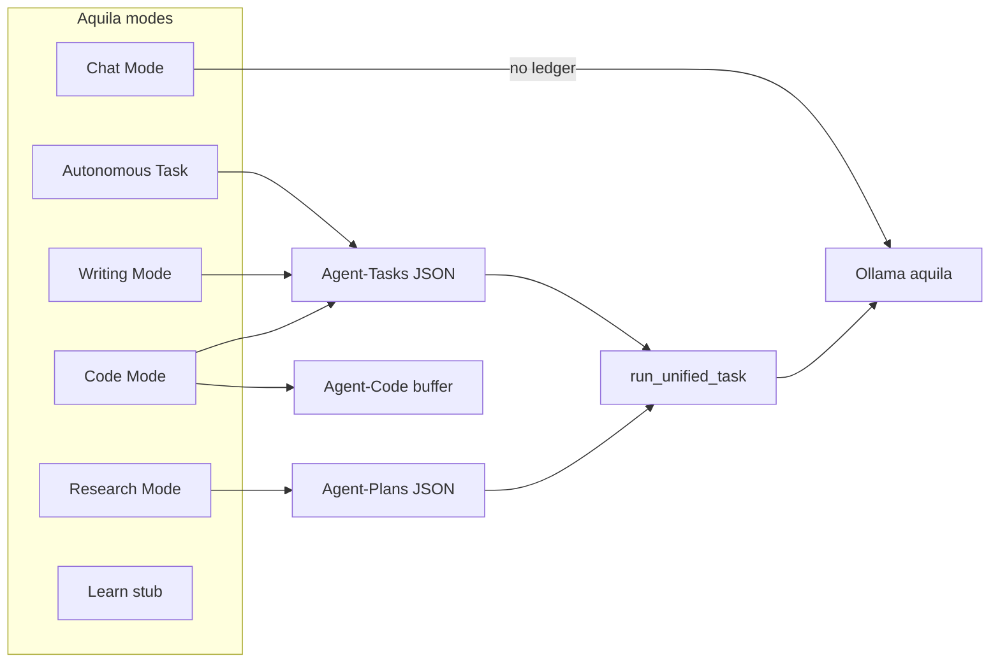

# Aquila OS 3.4

**Aquila OS** is a **local-first autonomous AI agent** that runs on your machine, talks to **[Ollama](https://ollama.com)** with a custom fine-tuned workflow model (`aquila`), and executes real work through **strict JSON tool-calling** — file I/O, web research, coding, email, and long-form writing — without sending your data to a cloud LLM.

Version **3.4** ships **dedicated workspace GUIs** per mode (Chat, Task, Research, Writing, Code), **multi-instance** profiles with isolated memory, per-step **tool routing**, and an **editable Code IDE** with patch review. Built on **3.3** (Code Mode canvas, TurboQuant up to **96k**, context-budget web enrichment, `loop_engine.py`). The **PySide6** desktop app is the primary interface; **pytest** (~70 modules, 260+ tests) covers core and GUI behavior.

For a line-by-line architecture deep dive, see **[ARCHITECTURE.md](ARCHITECTURE.md)**.

---

## Table of contents

1. [What Aquila does](#what-aquila-does)
2. [What's new in 3.4](#whats-new-in-34)
3. [What's new in 3.3](#whats-new-in-33)
4. [System requirements](#system-requirements)
5. [Installation](#installation)
6. [Quick start](#quick-start)
7. [Operational modes](#operational-modes)
8. [How the agent loop works](#how-the-agent-loop-works)
9. [Filesystem layout](#filesystem-layout)
10. [Tools reference](#tools-reference)
11. [Memory and sleep cycle](#memory-and-sleep-cycle)
12. [Attachments and research journal](#attachments-and-research-journal)
13. [Configuration](#configuration)
14. [Testing](#testing)
15. [Security model](#security-model)
16. [Troubleshooting](#troubleshooting)
17. [Known limitations and 3.5 direction](#known-limitations-and-35-direction)
18. [Development notes](#development-notes)

---

## What Aquila does

Aquila is not a chat wrapper. It is a small **operating system for an agent**:

| Layer | Responsibility |
|-------|----------------|
| **GUI** (`agent/gui.py`) | PySide6 app: instance home, per-mode workspaces, attachments, sleep cycle |
| **Brain** (`agent/main.py`) | Plans multi-step work, runs the tool loop, saves deliverables, sleep consolidation |
| **Tools** (`agent/tools.py` + `agent/tool_library/`) | Callable capabilities exposed to the model via JSON schema |
| **Memory** (`agent/memory.py`) | SQLite facts + ChromaDB episodic / tool / codebase search |
| **Ledgers** (`Agent-Tasks/`, `Agent-Plans/`) | JSON state machines that survive restarts and UI disconnects |
| **Search** (Docker SearXNG) | Private web search on `localhost:8080` — no Bing/Google API keys |

The model (`aquila`, based on **Qwen 3.5 9B** with 32k context) must output **only** valid JSON each turn: `reasoning`, optional `final_report`, and a `tools` array. The OS executes tools, feeds results back, and advances step ledgers until the task completes.

---

## What's new in 3.4

Compared to **Aquila 3.3**:

### User-facing

- **Dedicated workspaces** — `gui_pages/` pages for Chat, Task (Autonomous), Research, Writing, and Code (`QStackedWidget` in `gui.py`).
- **Research desk** — in-GUI SearXNG search + reader; **human journal** (`Agent-Research/.journal/`) injectable into every research step.
- **Writing home + canvas** — list `Agent-Drafts/*.md`, open/edit in markdown canvas; quick selection edits via **chat subcall**.
- **Task workspace** — plan column with step status; output preview; placeholder for future multi-mode call stack.
- **Editable Code IDE** — user edits in tabs, **Save buffer** (`apply_user_buffer_edit`), tree→tab navigation, patch Accept/Reject with conflict warning.
- **Shared UI kit** — `gui_widgets/` (`AgentRail`, `ExecutionLogPanel`), `gui_theme.py`, rich-text ledger formatting.
- **Instance home** — `home_page.py` picker; per-instance scratchpad/episodic isolation (`instance_registry.py`).

### Agent core

- **Per-step tool routing** — `LoopEngine._schema_for_step` + `tool_catalog.py` / `tool_policy.py` (no longer full schema every turn).
- **Multi-chunk attachments** — `format_attachment_context()` concatenates chunks with tier cap.
- **Research journal injection** — `research_journal.py` + `LoopEngine.human_research_notes` on each step entry.
- **Writing canvas sync** — `writing_canvas.py` maps flat markdown ↔ `active_draft_state.json`.

**QA:** manual checklist in **[docs/workspace-qa-3.4.md](docs/workspace-qa-3.4.md)**.

**Deferred to 3.5:** Learn mode classroom UI (stub only in 3.4).

---

## What's new in 3.3

Compared to **Aquila 3.2** (PySide6 stabilization, Writing Mode):

### User-facing

- **Code Mode** — dedicated IDE workspace (`gui_pages/code_ide_page.py`): import or attach a repo, file tree, TDD step validation, pytest/flake8 rail.
- **Mode workspaces** — dedicated `gui_pages/` per mode (Chat, Task, Research, Writing, Code); Learn stub until 3.5.
- **TurboQuant models** — `aquila-tq-32k`, `aquila-tq-64k`, `aquila-tq-96k` on a separate Ollama port (see [docs/ollama-turboquant.md](docs/ollama-turboquant.md)).
- **Research bibliographies** — visited/scraped URLs appended to deliverables when research mode completes.

### Agent core

- **`loop_engine.py`** — reflect/act loop with grace budget, step entry ritual, final-step stall detection.
- **`context_budget.py`** — tiered limits (`compact` / `standard` / `extended` / `max`) for scrape count, scrape size, scratchpad, `read_file`, directory tree depth — scaled from `OLLAMA_NUM_CTX`.
- **`web_enrichment.py`** — tiered auto-scrape after `web_search`, URL scoring, `SourceRegistry` for bibliography markdown.
- **Code project scope** — `write_file` / reads constrained to `CODE_PROJECT_ROOT` when a code project is open; sandbox vs in-place workspace modes.
- **`plan_validator.py`** — budget-aware plan validation before execution.

### Carried from 3.2

- **PySide6 desktop UI**, **Writing Mode**, **attachments**, **Task State Tracker**, strict JSON tool loop, shared memory singleton, sleep cycle.
- **`agent/legacy/streamlit_app.py`** — legacy 3.1 Streamlit UI (unsupported). Use `gui.py`.
- **`route_tools()`** — semantic tool subset (superseded in 3.4 by catalog-based routing; see `tool_catalog.py`).

---

## System requirements

| Component | Version / notes |
|-----------|-----------------|
| **OS** | Windows 10+, macOS, or Linux |
| **Python** | 3.10+ recommended |
| **Ollama** | Running locally; model `aquila` built from repo `Modelfile` |
| **Docker** | For SearXNG (`docker compose`); port **8080** |
| **RAM** | 16 GB+ recommended for 9B model + Chroma |
| **GPU** | Optional; Ollama uses GPU when available |

---

## Installation

### 1. Clone and enter the repo

```bash
git clone <your-repo-url> agent-projects
cd agent-projects
```

**Important:** Run Aquila from the **repository root** (`agent-projects/`). Runtime data (`Agent-*`, `vector_db/`) is resolved via [`agent/workspace_paths.py`](agent/workspace_paths.py) (repo root by default). Override with `AQUILA_DATA_ROOT` for isolated tests.

### 2. Create a virtual environment

```bash
python -m venv ai-agent-env

# Windows
ai-agent-env\Scripts\activate

# macOS / Linux
source ai-agent-env/bin/activate
```

### 3. Install Python dependencies

```bash
pip install -r requirements.txt
```

Optional Excel attachments (`.xlsx`):

```bash
pip install openpyxl>=3.1.0
```

### 4. Install and build the Ollama model

Install [Ollama](https://ollama.com), pull the base model, then create `aquila`:

```bash
ollama pull qwen3.5:9b
ollama create aquila -f Modelfile
```

The `Modelfile` sets `num_ctx 32768` and `temperature 0.2` at the model level; the agent uses lower temperatures (0.1–0.2) for task loops and 0.6 for chat.

Verify:

```bash
curl http://127.0.0.1:11434/api/tags
```

### 4b. Optional: TurboQuant (32k–96k on NVIDIA)

TurboQuant compresses the KV cache so longer context fits on the same GPU. Full guide: **[docs/ollama-turboquant.md](docs/ollama-turboquant.md)**.

```powershell
# Once: build portable Ollama from PR #15505
.\scripts\install-ollama-turboquant-pr.ps1

# Terminal 1 — TurboQuant on port 11435 (keeps tray Ollama on 11434 free)
.\scripts\ollama-serve-turboquant-port.ps1

# Terminal 2 — create models and run Aquila
.\scripts\ollama-create-tq-models.ps1
# .env: OLLAMA_BASE_URL=http://127.0.0.1:11435  OLLAMA_MODEL=aquila-tq-32k|64k|96k
python agent/gui.py
```

| Model | Context | Typical use |
|-------|---------|-------------|
| `aquila-tq-32k` | 32k | Light tasks, lowest VRAM |
| `aquila-tq-64k` | 64k | Default extended |
| `aquila-tq-96k` | 96k | Max context if VRAM allows |

Baseline `aquila` on port 11434 remains the default when TurboQuant env vars are unset.

### 5. Start SearXNG (web search)

```bash
docker compose up -d
```

Search endpoint: `http://localhost:8080/search` (used by `web_search`).

### 6. Optional: email tools

Copy `.env.EXAMPLE` to `.env` at the repo root and set SMTP variables for `send_email_tool`.

---

## Quick start

### One-command startup (recommended)

```bash
./start.sh
```

`start.sh` activates `ai-agent-env`, starts Docker, and launches `python agent/gui.py`.

### Manual startup

```bash
source ai-agent-env/bin/activate   # or Scripts\activate on Windows
docker compose up -d
python agent/gui.py
```

### First tasks to try

1. Launch the GUI → **Home** → create or open an instance → pick a workspace from the mode selector.
2. Try the prompts below.

| Mode | Example prompt |
|------|----------------|
| **Chat** | "Summarize what Aquila OS does in three bullets." |
| **Autonomous** | "Create `hello_aquila.py` in the repo root that prints Hello from Aquila and run it." |
| **Research** | "Compare local vs cloud LLM deployment costs for 7B–70B models in 2026." (optional: add notes in the journal pane first) |
| **Writing** | From Writing home: **New document** → "Write a 3-section markdown essay on why local AI agents matter." |
| **Code** | **Import sandbox** a repo → "Add pytest for the main module and make tests pass." |

After tasks finish, check **`Agent-Research/`**, **`Agent-Drafts/`**, or synced files under **`Agent-Code/`**. Ledgers live in **`Agent-Tasks/`** or **`Agent-Plans/`**.

---

## Operational modes



| Mode | Ledger file | Output folder | Completion |
|------|-------------|---------------|------------|
| **Chat** | None | N/A (in-UI only) | Streaming response |
| **Autonomous** | `Agent-Tasks/{task_name}.json` | `Agent-Creations/` (if `final_report`) | `finish_task` |
| **Research** | `Agent-Plans/{task_name}.json` | `Agent-Research/{task_name}.md` | `finish_task` + `final_report` |
| **Writing** | `Agent-Tasks/{task_name}.json` | `Agent-Drafts/` via `compile_final_document` | `finish_task` + brief summary in `final_report` |
| **Code** | `Agent-Tasks/{task_name}.json` + `Agent-Code/active_code_state.json` | Workspace via `sync_project_to_disk` | `finish_task` after TDD verify |

**Code Mode (3.3):** Python-first TDD with `run_pytest` / `run_linter`; patch-first editing (`replace_lines`, `apply_unified_patch`). JS/TS/Rust/Go: read/write + basic lint when CLIs are installed. Required: `pytest`, `flake8` (recommended).

**Prompt sources:** `agent/prompts.py` — `get_chat_prompt`, `get_autonomous_prompt`, `get_research_prompt`, `get_writing_prompt`, `get_code_prompt`.

### Mode workspaces (3.4)

The desktop UI switches **dedicated layouts** per mode (`agent/gui_pages/` + `QStackedWidget` in `agent/gui.py`):

| Workspace | Layout |
|-----------|--------|
| **Chat** | Single-column conversation (shared agent rail) |
| **Autonomous Task** | Task workspace: plan column, output preview, execution log |
| **Research** | SearXNG search panel, reader, human journal (injectable), agent rail |
| **Writing** | Document home (`Agent-Drafts`) + markdown canvas with preview |
| **Code** | IDE: editable tabs, file tree, buffer save, patch review, agent rail |
| **Learn** | Placeholder (classroom UI planned for **3.5**) |

**Code project open:** toolbar **Open in-place** (`attach_existing_repo`) or **Import sandbox** (`import_codebase` copy under `Agent-Code/{project}/`). For large repos the agent uses **manifest + search + regions**, not full directory trees in context.

---

## How the agent loop works

High-level flow for autonomous / research / writing (`run_unified_task` in `agent/main.py`):

1. **Planning** — If no ledger exists, `generate_plan()` asks the model for a JSON object: `steps[]` each with `description` and `max_iterations`. Plan is saved to disk.
2. **Step loop** — For the current step index, the OS sends one objective at a time. Conversation history is **wiped** when advancing steps (intentional amnesia); scratchpad notes persist in SQLite.
3. **Model turn** — Non-streaming chat with `format=build_strict_schema(executable_tools)`. Prefill starts `{"reasoning": "` to steer JSON.
4. **Validation** — `parse_agent_response()` + `validate_tool_calls()`; on failure, retry message (max 2 parse failures then forced advance or `finish_task` on last step).
5. **Execution** — Up to **6** tools per turn via `ToolExecutor`. Meta-tools: `mark_objective_complete`, `finish_task`.
6. **Advance** — `mark_objective_complete` updates ledger; `finish_task` saves deliverable, `complete_ledger_state()`, stores episodic memory.
7. **Guards** — Iteration limit per step, duplicate-tool warning, OS override messages when time is up.

**Paper trail rule:** The model should call `save_research_note` before `mark_objective_complete`, and `read_all_research_notes` at the start of a new step after a memory wipe.

---

## Filesystem layout

### Repository (tracked)

```
agent-projects/
├── agent/                 # Application package
│   ├── main.py            # Agent brain, loop, Ollama client
│   ├── loop_engine.py     # Reflect/act task loop
│   ├── gui.py             # PySide6 UI (primary)
│   ├── gui_pages/         # Per-mode workspaces (chat, task, research, writing, code)
│   ├── gui_widgets/       # Shared AgentRail, ExecutionLogPanel
│   ├── gui_theme.py       # Stylesheets + mode accents
│   ├── gui_state.py       # Ledger path + HTML renderers
│   ├── instance_registry.py
│   ├── workspace_paths.py # Canonical Agent-* paths
│   ├── research_journal.py
│   ├── writing_canvas.py
│   ├── prompts.py         # System prompts per mode
│   ├── tool_catalog.py    # Per-step tool routing
│   ├── tools.py           # Core file tools + security
│   ├── memory.py          # DualMemorySystem
│   ├── memory_singleton.py
│   ├── file_parser.py     # Attachments
│   ├── tool_library/      # Extended tools
│   ├── tests/             # pytest suite
│   └── legacy/            # Unmaintained Streamlit app
├── docs/
│   ├── workspace-qa-3.4.md
│   └── ollama-turboquant.md
├── requirements.txt
├── Modelfile              # Ollama aquila model (32k)
├── Modelfile.tq-32k       # TurboQuant 32k (light)
├── Modelfile.tq-64k       # TurboQuant 64k
├── Modelfile.tq-96k       # TurboQuant 96k (stretch)
├── scripts/               # Ollama TQ install, serve, model create
├── tools/                 # Local Ollama binaries (gitignored — see tools/README.md)
├── docker-compose.yml     # SearXNG
├── start.sh
├── README.md              # This file
└── ARCHITECTURE.md        # Deep technical reference
```

### Runtime (created at use; mostly gitignored)

| Path | Purpose |
|------|---------|
| `Agent-Tasks/` | JSON ledgers for autonomous + writing |
| `Agent-Plans/` | JSON ledgers for research |
| `Agent-Research/` | Research markdown deliverables |
| `Agent-Research/.journal/` | Per-instance human research notes (GUI) |
| `Agent-Creations/` | Task markdown deliverables |
| `Agent-Instances/` | Instance profiles + workspace summaries |
| `Agent-Drafts/` | Writing-mode draft state + compiled docs |
| `Agent-Code/` | Code Mode buffer (`active_code_state.json`) + synced workspace files |
| `Agent-Logs/` | Per-run execution logs |
| `Agent-Memory/` | SQLite `fact_graph.db` |
| `vector_db/` | ChromaDB persistence (repo root) |

---

## Tools reference

Tools are merged from `SURVIVAL_TOOLS` and `tool_library.ALL_TOOLS`. Internal `_index_codebase` is indexed into Chroma but **excluded** from the executable schema.

### Core (`agent/tools.py`)

| Tool | Purpose |
|------|---------|
| `read_file`, `read_file_lines` | Read workspace files |
| `write_file`, `replace_in_file` | Write / patch files |
| `list_directory`, `get_directory_tree` | Directory listing |
| `mark_objective_complete` | Advance ledger step |
| `finish_task` | Complete entire task |
| `search_tool_library` | Semantic search over tool docs in Chroma |

### Web (`tool_library/web_tools.py`)

| Tool | Purpose |
|------|---------|
| `web_search` | SearXNG JSON API |
| `read_webpage` | Fetch and extract page text |

### Coding (`tool_library/coding_tools.py`)

| Tool | Purpose |
|------|---------|
| `semantic_code_search` | Chroma codebase search |
| `replace_function` | AST-aware function replace |
| `test_python_script` | Run a Python file |

### OS (`tool_library/os_tools.py`)

| Tool | Purpose |
|------|---------|
| `search_in_file`, `search_files` | Grep-style search |
| `create_directory`, `delete_file`, `rename_file`, `move_file` | Filesystem ops |
| `manage_process` | Start/stop allowlisted processes |
| `get_env_variables` | Environment snapshot |

### Agent / memory (`tool_library/agent_tools.py`)

| Tool | Purpose |
|------|---------|
| `save_research_note`, `read_all_research_notes` | SQLite scratchpad per task |
| `store_fact`, `query_past_experience` | Long-term memory |
| `ask_user` | Blocking question to GUI |

### Writing (`tool_library/writing_tools.py`)

| Tool | Purpose |
|------|---------|
| `init_document`, `write_section`, `read_outline` | Draft buffer |
| `compile_final_document` | Flush to `Agent-Drafts/` |

### Code canvas (`tool_library/code_canvas_tools.py`)

| Tool | Purpose |
|------|---------|
| `init_code_project`, `read_code_outline` | Code buffer in `Agent-Code/` |
| `create_buffer_file`, `replace_lines`, `apply_unified_patch`, `replace_symbol` | Incremental edits |
| `read_file_region`, `sync_project_to_disk` | Targeted read + disk sync |
| `run_pytest`, `run_linter`, `set_test_targets` | TDD + lint (Python full) |
| `import_codebase`, `attach_existing_repo` | Manifest import (in-place or sandbox) |
| `index_codebase_for_search` | Semantic search scoped to project root |
| `apply_user_buffer_edit` | Full-file buffer update from GUI editor |

### Email (`tool_library/email_tools.py`)

| Tool | Purpose |
|------|---------|
| `send_email_tool` | SMTP (requires `.env`) |

---

## Memory and sleep cycle

**Dual memory** (`DualMemorySystem`):

- **Facts** — SQLite `Agent-Memory/fact_graph.db`
- **Episodic** — ChromaDB `vector_db/` at repo root (experiences, tool docs, codebase chunks)

**Sleep cycle** (`initiate_sleep_cycle()` from GUI or API): scans completed ledgers in `Agent-Tasks/` and `Agent-Plans/`, consolidates scratchpad + outcomes into long-term memory.

---

## Attachments and research journal

**File attachments** (paperclip on any workspace with an agent rail): `file_parser.process_local_attachments()` returns:

- **Text chunks** — merged into planner and the first loop turn as `--- ATTACHED CONTEXT ---` (multi-chunk, tier-capped via `format_attachment_context()`)
- **Images** — base64 payloads for Ollama vision in chat/research

Supported formats include `.pdf`, `.docx`, `.csv`, `.html`, images (`.png`, `.jpg`, `.webp`, `.gif`), and common code/text extensions. Max **5 MB** per file; CSV capped at 200 rows in preview.

**Research journal** (Research workspace): markdown notes saved under `Agent-Research/.journal/{instance_id}.md`. With **Include in next run** enabled, notes are injected on **every** research step (via `LoopEngine.human_research_notes`), so step amnesia does not drop your context.

---

## Configuration

| Item | Location | Notes |
|------|----------|-------|
| Ollama URL | `.env` → `OLLAMA_BASE_URL` | Default `http://127.0.0.1:11434` |
| Ollama model | `.env` → `OLLAMA_MODEL` | Default `aquila`; use `aquila-tq-64k` with TurboQuant |
| Ollama context override | `.env` → `OLLAMA_NUM_CTX` | Optional; e.g. `65536` without recreating model |
| TurboQuant serve | `scripts/ollama-serve-turboquant.ps1` | Start Ollama before Aquila; see [docs/ollama-turboquant.md](docs/ollama-turboquant.md) |
| SearXNG | `docker-compose.yml`, `searxng-settings.yml` | Port 8080 |
| SMTP | `.env` (from `.env.EXAMPLE`) | Email tool only |
| Pytest | `agent/pytest.ini` | `live` marker for Ollama integration tests |
| Data root | `AQUILA_DATA_ROOT` | Default: repo root; see `workspace_paths.py` |
| Working directory | Process cwd | Repo root recommended; `start.sh` and `ensure_repo_cwd()` enforce this |

---

## Testing

From `agent/` with venv active:

```bash
cd agent
pytest tests/ -q --ignore=tests/test_live_ollama.py --ignore=tests/test_live_prompts.py --ignore=tests/test_live_context_smoke.py
```

**Release check** (unit + GUI; live tests need Ollama running):

```bash
cd agent
pytest tests/ -v --tb=short
```

Include live Ollama tests only (requires running Ollama; model from `OLLAMA_MODEL`):

```bash
pytest tests/ -m live -v
# TurboQuant / 64k smoke (set OLLAMA_MODEL=aquila-tq-64k first):
pytest tests/test_live_context_smoke.py -m live -v
```

GUI and workspace pages:

```bash
pytest tests/test_gui*.py tests/test_research_journal.py tests/test_writing_canvas.py tests/test_code_user_edit.py -v
```

Manual workspace QA: **[docs/workspace-qa-3.4.md](docs/workspace-qa-3.4.md)**

Context benchmark (manual VRAM check):

```bash
python scripts/benchmark_context.py
```

**Coverage highlights:**

| Area | Test modules |
|------|----------------|
| Planner JSON recovery | `test_behavior_planner.py` |
| Loop guards / schema | `test_loop_guards.py`, `test_schema_tools.py` |
| Unified task flow | `test_run_unified_task.py` |
| GUI / workspaces | `test_gui.py`, `test_gui_*_page.py`, `test_gui_state_tracker.py`, `test_gui_formatting.py` |
| Research journal | `test_research_journal.py` |
| Writing canvas | `test_writing_canvas.py` |
| Code GUI edits | `test_code_user_edit.py`, `test_gui_code_page.py` |
| Attachments | `test_attachment_injection.py`, `test_file_parser.py` |
| Tool routing | `test_tool_catalog.py`, `test_tool_policy.py` |
| Instances | `test_instance_registry.py`, `test_memory_instance_scope.py` |
| Ledgers / sleep | `test_ledger_completion.py`, `test_sleep_cycle.py` |
| Tools | `test_coding_tools.py`, `test_web_tools.py`, `test_writing_tools.py`, … |

---

## Security model

Defense in depth for a tool-using agent:

1. **Path firewall** — `is_safe_path()` blocks writes outside `AGENT_ROOT_DIR` (repo cwd).
2. **Strict JSON schema** — Unknown tools and malformed tool objects are rejected.
3. **Ledger protection** — Tools cannot directly edit `Agent-Tasks/*.json` / `Agent-Plans/*.json`.
4. **Process allowlist** — `manage_process` only starts/stops known apps.
5. **Output truncation** — Large directory trees and tool outputs are capped.

**You are still running an autonomous agent with shell and file access.** Use on trusted machines; review plans and logs in `Agent-Logs/`.

---

## Troubleshooting

| Symptom | Likely cause | Fix |
|---------|--------------|-----|
| `Connection refused` to Ollama | Ollama not running | `ollama serve` / start Ollama app |
| Model not found | `aquila` not created | `ollama create aquila -f Modelfile` |
| `web_search` fails | SearXNG down | `docker compose up -d` |
| Empty Task State Tracker | Wrong cwd or missing ledger | Run from repo root; check `Agent-Plans/` or `Agent-Tasks/` |
| Deliverable not on disk | Missing `final_report` or wrong mode path | Research: top-level `final_report` in JSON; see `save_task_deliverable()` |
| `tool_name` instead of `name` | Streaming on tool turns | 3.2 uses `stream=False` for tool loop — ensure you are on 3.2 `main.py` |
| Double chat messages | Old GUI | Upgrade to 3.2 `chat_finished` signal handling |
| Tests fail on import | Wrong directory | Run pytest from `agent/` per `pytest.ini` |
| Chroma / slow test collection | `Agent()` indexes on import | Tests use lazy `global_agent` proxy where possible |

---

## Known limitations and 3.5 direction

Documented in [ARCHITECTURE.md](ARCHITECTURE.md):

- **Learn mode** — stub UI only; classroom/LMS layout planned for **3.5**.
- **Inter-modal orchestration** — Task workspace shows a placeholder mode stack; single-agent loops today.
- **Embedded browser** — Research uses SearXNG JSON search panel, not an in-app browser (WebEngine deferred).
- Streamlit (`agent/legacy/streamlit_app.py`) not maintained.
- Non-Python test runners (Jest, `cargo test`, `go test`) not wired in v1.
- **MCP bridge** — stub for a future release (`mcp_bridge.py`).

---

## Development notes

### Project conventions

- **Primary UI:** `agent/gui.py` — not `app.py`.
- **Do not normalize** bad tool calls (e.g. `tool_name` → `name`); fix via schema + non-streaming.
- **Commits:** User-led; this README documents release state on branch `Aquila-3.4`.
- **Logs:** `Agent-Logs/{task}_{timestamp}.log` for full iteration + tool traces.

### Useful commands

```bash
# Dump current strict JSON schema (dev)
python agent/test_schema.py

# Sleep consolidation (if exposed in your build)
python -c "from main import initiate_sleep_cycle; print(initiate_sleep_cycle())"
```

### Branch / release

- **3.1:** `Aquila-3.1` — Streamlit, research mode complete.
- **3.2:** `Aquila-3.2` — PySide6, writing mode, tests, loop hardening.
- **3.3:** `Aquila-3.3` — Code Mode, TurboQuant, context budget, web enrichment.
- **3.4:** `Aquila-3.4` — Dedicated workspaces, instances, editable Code IDE, research journal (this document).

---

## Credits and model

- Base model: **Qwen 3.5 9B** via Ollama (`Modelfile`).
- Web search: **SearXNG** (Docker).
- Desktop UI: **Qt for Python (PySide6)**.

For questions about internals, start with [ARCHITECTURE.md](ARCHITECTURE.md) §17 (key files to read first).
