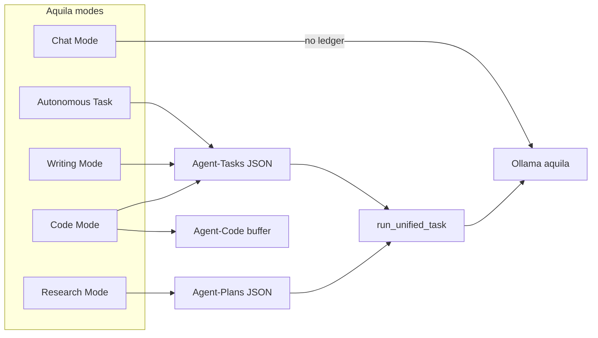

# Aquila OS 3.2

**Aquila OS** is a **local-first autonomous AI agent** that runs on your machine, talks to **[Ollama](https://ollama.com)** with a custom fine-tuned workflow model (`aquila`), and executes real work through **strict JSON tool-calling** — file I/O, web research, coding, email, and long-form writing — without sending your data to a cloud LLM.

Version **3.2** is a stabilization and quality release on top of 3.1: a **PySide6 desktop GUI** replaces Streamlit as the primary interface, the **agent loop** is hardened for reliable tool calls, **Writing Mode** ships end-to-end, attachments work in all modes, and a **pytest suite** (~30 modules, 98+ tests) covers core behavior.

For a line-by-line architecture deep dive, see **[ARCHITECTURE.md](ARCHITECTURE.md)**.

---

## Table of contents

1. [What Aquila does](#what-aquila-does)
2. [What's new in 3.2](#whats-new-in-32)
3. [System requirements](#system-requirements)
4. [Installation](#installation)
5. [Quick start](#quick-start)
6. [Operational modes](#operational-modes)
7. [How the agent loop works](#how-the-agent-loop-works)
8. [Filesystem layout](#filesystem-layout)
9. [Tools reference](#tools-reference)
10. [Memory and sleep cycle](#memory-and-sleep-cycle)
11. [Attachments](#attachments)
12. [Configuration](#configuration)
13. [Testing](#testing)
14. [Security model](#security-model)
15. [Troubleshooting](#troubleshooting)
16. [Known limitations and 3.3 direction](#known-limitations-and-33-direction)
17. [Development notes](#development-notes)

---

## What Aquila does

Aquila is not a chat wrapper. It is a small **operating system for an agent**:

| Layer | Responsibility |
|-------|----------------|
| **GUI** (`agent/gui.py`) | PySide6 app: chat, autonomous tasks, research, writing, task tracker, attachments |
| **Brain** (`agent/main.py`) | Plans multi-step work, runs the tool loop, saves deliverables, sleep consolidation |
| **Tools** (`agent/tools.py` + `agent/tool_library/`) | Callable capabilities exposed to the model via JSON schema |
| **Memory** (`agent/memory.py`) | SQLite facts + ChromaDB episodic / tool / codebase search |
| **Ledgers** (`Agent-Tasks/`, `Agent-Plans/`) | JSON state machines that survive restarts and UI disconnects |
| **Search** (Docker SearXNG) | Private web search on `localhost:8080` — no Bing/Google API keys |

The model (`aquila`, based on **Qwen 3.5 9B** with 32k context) must output **only** valid JSON each turn: `reasoning`, optional `final_report`, and a `tools` array. The OS executes tools, feeds results back, and advances step ledgers until the task completes.

---

## What's new in 3.2

Compared to **Aquila 3.1** (Streamlit-first, research-complete):

### User-facing

- **PySide6 desktop UI** — dark theme, tabbed ledger tracker, streaming chat, cancel button, resume in-progress ledgers, **Clear Chat View** (display only; history preserved for the model).
- **Writing Mode** — `init_document`, `write_section`, `read_outline`, `compile_final_document`; drafts under `Agent-Drafts/`.
- **Attachments** — images (vision in chat/research), PDF, DOCX, CSV, HTML, and many text/code formats via `agent/file_parser.py` (5 MB cap per file).
- **Task State Tracker** — live HTML for autonomous, research (`Agent-Plans/`), and writing steps.

### Agent core

- **Dynamic strict JSON schema** — `build_strict_schema()` generates per-tool `anyOf` branches from function signatures; Ollama `format` + `stream=False` on tool turns (streaming broke schema compliance).
- **Loop guards** — max 6 tools per turn, parse/schema retry, duplicate-tool warning, programmatic advance on stall, `complete_ledger_state()` on `finish_task`.
- **Deliverables** — `save_task_deliverable()` writes `Agent-Research/{task}.md` or `Agent-Creations/{task}.md`; research `final_report` at top level of JSON response.
- **Attachment injection** — `text_chunks` injected into planner and first loop turn.
- **Shared memory singleton** — `memory_singleton.aquila_memory` used by `main` and `agent_tools` (fixes split-brain scratchpad).
- **Sleep cycle** — consolidates completed tasks from both `Agent-Tasks/` and `Agent-Plans/`.

### Engineering

- **`requirements.txt`** at repo root.
- **`agent/pytest.ini`** + **`agent/tests/conftest.py`** + 30 test modules (unit + optional live Ollama).
- **`ARCHITECTURE.md`** — full system documentation.

### Intentionally unchanged / legacy

- **`agent/app.py`** (Streamlit) — legacy 3.1 UI; **not maintained** for 3.2. Use `gui.py`.
- **`route_tools()`** — semantic tool routing exists but is **not wired** into the loop; full tool schema is always sent.

---

## System requirements

| Component | Version / notes |
|-----------|-----------------|
| **OS** | Windows 10+, macOS, or Linux |
| **Python** | 3.10+ recommended |
| **Ollama** | Running locally; model `aquila` built from repo `Modelfile` |
| **Docker** | For SearXNG (`docker compose`); port **8080** |
| **RAM** | 16 GB+ recommended for 9B model + Chroma |
| **GPU** | Optional; Ollama uses GPU when available |

---

## Installation

### 1. Clone and enter the repo

```bash
git clone <your-repo-url> agent-projects
cd agent-projects
```

**Important:** Always run Aquila from the **repository root** (`agent-projects/`). Tool paths and `Agent-*` output folders are resolved relative to `os.getcwd()`.

### 2. Create a virtual environment

```bash
python -m venv ai-agent-env

# Windows
ai-agent-env\Scripts\activate

# macOS / Linux
source ai-agent-env/bin/activate
```

### 3. Install Python dependencies

```bash
pip install -r requirements.txt
```

Optional Excel attachments (`.xlsx`):

```bash
pip install openpyxl>=3.1.0
```

### 4. Install and build the Ollama model

Install [Ollama](https://ollama.com), pull the base model, then create `aquila`:

```bash
ollama pull qwen3.5:9b
ollama create aquila -f Modelfile
```

The `Modelfile` sets `num_ctx 32768` and `temperature 0.2` at the model level; the agent uses lower temperatures (0.1–0.2) for task loops and 0.6 for chat.

Verify:

```bash
curl http://127.0.0.1:11434/api/tags
```

### 4b. Optional: TurboQuant (32k–96k on NVIDIA)

TurboQuant compresses the KV cache so longer context fits on the same GPU. Full guide: **[docs/ollama-turboquant.md](docs/ollama-turboquant.md)**.

```powershell
# Once: build portable Ollama from PR #15505
.\scripts\install-ollama-turboquant-pr.ps1

# Terminal 1 — TurboQuant on port 11435 (keeps tray Ollama on 11434 free)
.\scripts\ollama-serve-turboquant-port.ps1

# Terminal 2 — create models and run Aquila
.\scripts\ollama-create-tq-models.ps1
# .env: OLLAMA_BASE_URL=http://127.0.0.1:11435  OLLAMA_MODEL=aquila-tq-32k|64k|96k
python agent/gui.py
```

| Model | Context | Typical use |
|-------|---------|-------------|
| `aquila-tq-32k` | 32k | Light tasks, lowest VRAM |
| `aquila-tq-64k` | 64k | Default extended |
| `aquila-tq-96k` | 96k | Max context if VRAM allows |

Baseline `aquila` on port 11434 remains the default when TurboQuant env vars are unset.

### 5. Start SearXNG (web search)

```bash
docker compose up -d
```

Search endpoint: `http://localhost:8080/search` (used by `web_search`).

### 6. Optional: email tools

Copy `.env.EXAMPLE` to `.env` at the repo root and set SMTP variables for `send_email_tool`.

---

## Quick start

### One-command startup (recommended)

```bash
./start.sh
```

`start.sh` activates `ai-agent-env`, starts Docker, and launches `python agent/gui.py`.

### Manual startup

```bash
source ai-agent-env/bin/activate   # or Scripts\activate on Windows
docker compose up -d
python agent/gui.py
```

### First tasks to try

| Mode | Example prompt |
|------|----------------|
| **Chat** | "Summarize what Aquila OS does in three bullets." |
| **Autonomous** | "Create `hello_aquila.py` in the repo root that prints Hello from Aquila and run it." |
| **Research** | "Compare local vs cloud LLM deployment costs for 7B–70B models in 2026." |
| **Writing** | "Write a 3-section markdown essay on why local AI agents matter." |

After a research or writing task finishes, check **`Agent-Research/`** or **`Agent-Drafts/`** for output. Ledgers live in **`Agent-Tasks/`** or **`Agent-Plans/`**.

---

## Operational modes



| Mode | Ledger file | Output folder | Completion |
|------|-------------|---------------|------------|
| **Chat** | None | N/A (in-UI only) | Streaming response |
| **Autonomous** | `Agent-Tasks/{task_name}.json` | `Agent-Creations/` (if `final_report`) | `finish_task` |
| **Research** | `Agent-Plans/{task_name}.json` | `Agent-Research/{task_name}.md` | `finish_task` + `final_report` |
| **Writing** | `Agent-Tasks/{task_name}.json` | `Agent-Drafts/` via `compile_final_document` | `finish_task` + brief summary in `final_report` |
| **Code** | `Agent-Tasks/{task_name}.json` + `Agent-Code/active_code_state.json` | Workspace via `sync_project_to_disk` | `finish_task` after TDD verify |

**Code Mode (3.3):** Python-first TDD with `run_pytest` / `run_linter`; patch-first editing (`replace_lines`, `apply_unified_patch`). JS/TS/Rust/Go: read/write + basic lint when CLIs are installed. Required: `pytest`, `flake8` (recommended).

**Prompt sources:** `agent/prompts.py` — `get_chat_prompt`, `get_autonomous_prompt`, `get_research_prompt`, `get_writing_prompt`, `get_code_prompt`.

### Mode workspaces (3.4)

The desktop UI switches **dedicated layouts** per mode (`agent/gui_pages/` + `QStackedWidget` in `agent/gui.py`):

| Workspace | Layout |
|-----------|--------|
| **Chat** | Single-column conversation |
| **Autonomous Task** | All-in-one: chat + canvas + execution log (unchanged behavior) |
| **Research / Writing** | Same 3-pane as Autonomous until dedicated pages ship |
| **Code** | IDE: file tree, read-only editor tabs, agent rail, lint/pytest strips |
| **Learn** | Placeholder (classroom UI planned for 4.0) |

**Code project open:** toolbar **Open in-place** (`attach_existing_repo`) or **Import sandbox** (`import_codebase` copy under `Agent-Code/{project}/`). For large repos the agent uses **manifest + search + regions**, not full directory trees in context.

---

## How the agent loop works

High-level flow for autonomous / research / writing (`run_unified_task` in `agent/main.py`):

1. **Planning** — If no ledger exists, `generate_plan()` asks the model for a JSON object: `steps[]` each with `description` and `max_iterations`. Plan is saved to disk.
2. **Step loop** — For the current step index, the OS sends one objective at a time. Conversation history is **wiped** when advancing steps (intentional amnesia); scratchpad notes persist in SQLite.
3. **Model turn** — Non-streaming chat with `format=build_strict_schema(executable_tools)`. Prefill starts `{"reasoning": "` to steer JSON.
4. **Validation** — `parse_agent_response()` + `validate_tool_calls()`; on failure, retry message (max 2 parse failures then forced advance or `finish_task` on last step).
5. **Execution** — Up to **6** tools per turn via `ToolExecutor`. Meta-tools: `mark_objective_complete`, `finish_task`.
6. **Advance** — `mark_objective_complete` updates ledger; `finish_task` saves deliverable, `complete_ledger_state()`, stores episodic memory.
7. **Guards** — Iteration limit per step, duplicate-tool warning, OS override messages when time is up.

**Paper trail rule:** The model should call `save_research_note` before `mark_objective_complete`, and `read_all_research_notes` at the start of a new step after a memory wipe.

---

## Filesystem layout

### Repository (tracked)

```
agent-projects/
├── agent/                 # Application package
│   ├── main.py            # Agent brain, loop, Ollama client
│   ├── gui.py             # PySide6 UI (primary)
│   ├── prompts.py         # System prompts per mode
│   ├── tools.py           # Core file tools + security
│   ├── memory.py          # DualMemorySystem
│   ├── memory_singleton.py
│   ├── file_parser.py     # Attachments
│   ├── gui_state.py       # Ledger path + HTML renderers
│   ├── tool_library/      # Extended tools
│   └── tests/             # pytest suite
├── requirements.txt
├── Modelfile              # Ollama aquila model (32k)
├── Modelfile.tq-32k       # TurboQuant 32k (light)
├── Modelfile.tq-64k       # TurboQuant 64k
├── Modelfile.tq-96k       # TurboQuant 96k (stretch)
├── scripts/               # Ollama TQ install, serve, model create
├── tools/                 # Local Ollama binaries (gitignored — see tools/README.md)
├── docker-compose.yml     # SearXNG
├── start.sh
├── README.md              # This file
└── ARCHITECTURE.md        # Deep technical reference
```

### Runtime (created at use; mostly gitignored)

| Path | Purpose |
|------|---------|
| `Agent-Tasks/` | JSON ledgers for autonomous + writing |
| `Agent-Plans/` | JSON ledgers for research |
| `Agent-Research/` | Research markdown deliverables |
| `Agent-Creations/` | Task markdown deliverables |
| `Agent-Drafts/` | Writing-mode draft state + compiled docs |
| `Agent-Code/` | Code Mode buffer (`active_code_state.json`) + synced workspace files |
| `Agent-Logs/` | Per-run execution logs |
| `Agent-Memory/` | SQLite `fact_graph.db` |
| `agent/vector_db/` | ChromaDB persistence |

---

## Tools reference

Tools are merged from `SURVIVAL_TOOLS` and `tool_library.ALL_TOOLS`. Internal `_index_codebase` is indexed into Chroma but **excluded** from the executable schema.

### Core (`agent/tools.py`)

| Tool | Purpose |
|------|---------|
| `read_file`, `read_file_lines` | Read workspace files |
| `write_file`, `replace_in_file` | Write / patch files |
| `list_directory`, `get_directory_tree` | Directory listing |
| `mark_objective_complete` | Advance ledger step |
| `finish_task` | Complete entire task |
| `search_tool_library` | Semantic search over tool docs in Chroma |

### Web (`tool_library/web_tools.py`)

| Tool | Purpose |
|------|---------|
| `web_search` | SearXNG JSON API |
| `read_webpage` | Fetch and extract page text |

### Coding (`tool_library/coding_tools.py`)

| Tool | Purpose |
|------|---------|
| `semantic_code_search` | Chroma codebase search |
| `replace_function` | AST-aware function replace |
| `test_python_script` | Run a Python file |

### OS (`tool_library/os_tools.py`)

| Tool | Purpose |
|------|---------|
| `search_in_file`, `search_files` | Grep-style search |
| `create_directory`, `delete_file`, `rename_file`, `move_file` | Filesystem ops |
| `manage_process` | Start/stop allowlisted processes |
| `get_env_variables` | Environment snapshot |

### Agent / memory (`tool_library/agent_tools.py`)

| Tool | Purpose |
|------|---------|
| `save_research_note`, `read_all_research_notes` | SQLite scratchpad per task |
| `store_fact`, `query_past_experience` | Long-term memory |
| `ask_user` | Blocking question to GUI |

### Writing (`tool_library/writing_tools.py`)

| Tool | Purpose |
|------|---------|
| `init_document`, `write_section`, `read_outline` | Draft buffer |
| `compile_final_document` | Flush to `Agent-Drafts/` |

### Code canvas (`tool_library/code_canvas_tools.py`)

| Tool | Purpose |
|------|---------|
| `init_code_project`, `read_code_outline` | Code buffer in `Agent-Code/` |
| `create_buffer_file`, `replace_lines`, `apply_unified_patch`, `replace_symbol` | Incremental edits |
| `read_file_region`, `sync_project_to_disk` | Targeted read + disk sync |
| `run_pytest`, `run_linter`, `set_test_targets` | TDD + lint (Python full) |
| `import_codebase`, `attach_existing_repo` | Manifest import (in-place or sandbox) |
| `index_codebase_for_search` | Semantic search scoped to project root |

### Email (`tool_library/email_tools.py`)

| Tool | Purpose |
|------|---------|
| `send_email_tool` | SMTP (requires `.env`) |

---

## Memory and sleep cycle

**Dual memory** (`DualMemorySystem`):

- **Facts** — SQLite `Agent-Memory/fact_graph.db`
- **Episodic** — ChromaDB `agent/vector_db/` (experiences, tool docs, codebase chunks)

**Sleep cycle** (`initiate_sleep_cycle()` from GUI or API): scans completed ledgers in `Agent-Tasks/` and `Agent-Plans/`, consolidates scratchpad + outcomes into long-term memory.

---

## Attachments

Use the paperclip in the GUI to attach files before sending a message. `file_parser.process_local_attachments()` returns:

- **Text chunks** — injected into planner / first loop turn as `--- ATTACHED CONTEXT ---`
- **Images** — base64 payloads for Ollama vision in chat/research

Supported formats include `.pdf`, `.docx`, `.csv`, `.html`, images (`.png`, `.jpg`, `.webp`, `.gif`), and common code/text extensions. Max **5 MB** per file; CSV capped at 200 rows in preview.

---

## Configuration

| Item | Location | Notes |
|------|----------|-------|
| Ollama URL | `.env` → `OLLAMA_BASE_URL` | Default `http://127.0.0.1:11434` |
| Ollama model | `.env` → `OLLAMA_MODEL` | Default `aquila`; use `aquila-tq-64k` with TurboQuant |
| Ollama context override | `.env` → `OLLAMA_NUM_CTX` | Optional; e.g. `65536` without recreating model |
| TurboQuant serve | `scripts/ollama-serve-turboquant.ps1` | Start Ollama before Aquila; see [docs/ollama-turboquant.md](docs/ollama-turboquant.md) |
| SearXNG | `docker-compose.yml`, `searxng-settings.yml` | Port 8080 |
| SMTP | `.env` (from `.env.EXAMPLE`) | Email tool only |
| Pytest | `agent/pytest.ini` | `live` marker for Ollama integration tests |
| Working directory | Process cwd | Must be repo root for consistent `Agent-*` paths |

---

## Testing

From `agent/` with venv active:

```bash
cd agent
pytest tests/ -q --ignore=tests/test_live_ollama.py --ignore=tests/test_live_prompts.py
```

Include live Ollama tests (requires running Ollama; model from `OLLAMA_MODEL`, default `aquila`):

```bash
pytest tests/ -m live -v
# TurboQuant / 64k smoke (set OLLAMA_MODEL=aquila-tq-64k first):
pytest tests/test_live_context_smoke.py -m live -v
```

Context benchmark (manual VRAM check):

```bash
python scripts/benchmark_context.py
```

**Coverage highlights:**

| Area | Test modules |
|------|----------------|
| Planner JSON recovery | `test_behavior_planner.py` |
| Loop guards / schema | `test_loop_guards.py`, `test_schema_tools.py` |
| Unified task flow | `test_run_unified_task.py` |
| GUI / tracker | `test_gui.py`, `test_gui_state_tracker.py` |
| Attachments | `test_attachment_injection.py`, `test_file_parser.py` |
| Ledgers / sleep | `test_ledger_completion.py`, `test_sleep_cycle.py` |
| Tools | `test_coding_tools.py`, `test_web_tools.py`, `test_writing_tools.py`, … |

---

## Security model

Defense in depth for a tool-using agent:

1. **Path firewall** — `is_safe_path()` blocks writes outside `AGENT_ROOT_DIR` (repo cwd).
2. **Strict JSON schema** — Unknown tools and malformed tool objects are rejected.
3. **Ledger protection** — Tools cannot directly edit `Agent-Tasks/*.json` / `Agent-Plans/*.json`.
4. **Process allowlist** — `manage_process` only starts/stops known apps.
5. **Output truncation** — Large directory trees and tool outputs are capped.

**You are still running an autonomous agent with shell and file access.** Use on trusted machines; review plans and logs in `Agent-Logs/`.

---

## Troubleshooting

| Symptom | Likely cause | Fix |
|---------|--------------|-----|
| `Connection refused` to Ollama | Ollama not running | `ollama serve` / start Ollama app |
| Model not found | `aquila` not created | `ollama create aquila -f Modelfile` |
| `web_search` fails | SearXNG down | `docker compose up -d` |
| Empty Task State Tracker | Wrong cwd or missing ledger | Run from repo root; check `Agent-Plans/` or `Agent-Tasks/` |
| Deliverable not on disk | Missing `final_report` or wrong mode path | Research: top-level `final_report` in JSON; see `save_task_deliverable()` |
| `tool_name` instead of `name` | Streaming on tool turns | 3.2 uses `stream=False` for tool loop — ensure you are on 3.2 `main.py` |
| Double chat messages | Old GUI | Upgrade to 3.2 `chat_finished` signal handling |
| Tests fail on import | Wrong directory | Run pytest from `agent/` per `pytest.ini` |
| Chroma / slow test collection | `Agent()` indexes on import | Tests use lazy `global_agent` proxy where possible |

---

## Known limitations and 3.3 direction

Documented in [ARCHITECTURE.md](ARCHITECTURE.md):

- `route_tools()` not used — full tool list every turn.
- Streamlit UI not maintained.
- Code Mode canvas is **read-only** in the GUI (agent edits via tools; user edit-back deferred).
- Non-Python test runners (Jest, `cargo test`, `go test`) not wired in v1.
- Some integration paths are sensitive to **cwd** and duplicate tool calls under budget pressure.

**Shipped in 3.3:** budget-aware planner (`plan_validator.py`), reflect/act loop (`loop_engine.py`), **Code Mode** with TDD canvas (`code_canvas_tools.py`, `language_registry.py`).

---

## Development notes

### Project conventions

- **Primary UI:** `agent/gui.py` — not `app.py`.
- **Do not normalize** bad tool calls (e.g. `tool_name` → `name`); fix via schema + non-streaming.
- **Commits:** User-led; this README documents release state on branch `Aquila-3.2`.
- **Logs:** `Agent-Logs/{task}_{timestamp}.log` for full iteration + tool traces.

### Useful commands

```bash
# Dump current strict JSON schema (dev)
python agent/test_schema.py

# Sleep consolidation (if exposed in your build)
python -c "from main import initiate_sleep_cycle; print(initiate_sleep_cycle())"
```

### Branch / release

- **3.1:** `Aquila-3.1` — Streamlit, research mode complete.
- **3.2:** `Aquila-3.2` — PySide6, writing mode, tests, loop hardening (this document).

---

## Credits and model

- Base model: **Qwen 3.5 9B** via Ollama (`Modelfile`).
- Web search: **SearXNG** (Docker).
- Desktop UI: **Qt for Python (PySide6)**.

For questions about internals, start with [ARCHITECTURE.md](ARCHITECTURE.md) §17 (key files to read first).
