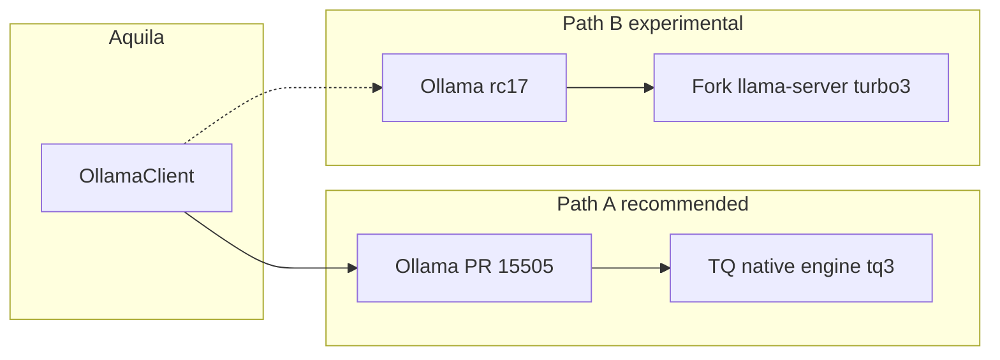

# Ollama TurboQuant for Aquila

TurboQuant compresses the **KV cache** on the GPU during inference. It does not replace weight quantization (GGUF Q4_K_M, etc.). With TurboQuant you can raise `num_ctx` (e.g. 32k → 64k) on the same NVIDIA GPU while running **Qwen 3.5 9B** as `aquila`.

TurboQuant appears in **two ecosystems** today with **different flag names**:

| Stack | KV cache flags | Status for Aquila |
|-------|----------------|-------------------|
| **Ollama** ([PR #15505](https://github.com/ollama/ollama/pull/15505)) | `OLLAMA_KV_CACHE_TYPE=tq2` … `tq4`, `tq3k`, … | Best fit: same API Aquila already uses |
| **llama.cpp** (community forks; [upstream PR #21307](https://github.com/ggml-org/llama.cpp/pull/21307) open) | `--cache-type-k turbo3` / `-ctk turbo4` | Not in stock Ollama’s bundled `llama-server` |

Official **ggml-org/llama.cpp** does not ship TurboQuant in stable releases yet. Community forks implement it in `llama-server`; Ollama’s released Windows builds still bundle a **stock** `llama-server`, which is why `OLLAMA_KV_CACHE_TYPE=tq2` fails with `Unsupported cache type: tq2` on v0.30.0-rc17.

## Prerequisites

- **Ollama** build that supports `OLLAMA_KV_CACHE_TYPE=tq*`.
- **NVIDIA GPU** (CUDA) for K+V presets with flash attention.
- Base model: `ollama pull qwen3.5:9b`

### Which Ollama build?

| Build | `tq3` / `tq3k` | `tq2` | How to get |
|-------|----------------|-------|------------|
| Stable **0.24.0** (default installer) | No | Yes (string present) | ollama.com |
| Pre-release **v0.30.0-rc17** | No | Yes | `.\scripts\install-ollama-turboquant.ps1` |
| **[PR #15505](https://github.com/ollama/ollama/pull/15505)** (open) | **Yes** | Yes | `.\scripts\install-ollama-turboquant-pr.ps1` (needs Go, CMake, VS2022) |

Until PR #15505 ships in a release, **public Windows builds do not run TurboQuant end-to-end** for Qwen 3.5: v0.30.0-rc17 sets `OLLAMA_KV_CACHE_TYPE=tq2` but the bundled `llama-server.exe` rejects `--cache-type-k tq2` (`Unsupported cache type`). PR #15505 implements TQ in the **native engine** (`ollamarunner`), not via llama-server cache flags.

**Working path today:** build from PR #15505 → `.\scripts\install-ollama-turboquant-pr.ps1` (Go, CMake, VS2022 C++ workload).

**Interim:** `.\scripts\install-ollama-turboquant.ps1` installs portable **v0.30.0-rc17** (better Qwen 3.5 support, flash attention) without working TQ until a PR build or fork swap is ready.

## Community llama.cpp forks (your note)

These are the main ways to use TurboQuant **outside** Ollama’s native engine, by running a TurboQuant-enabled **llama-server**:

| Fork | Focus | Typical flags |
|------|--------|----------------|
| [AtomicBot-ai/atomic-llama-cpp-turboquant](https://github.com/AtomicBot-ai/atomic-llama-cpp-turboquant) | Weights + KV; CUDA/Vulkan/HIP/Metal | `turbo2` / `turbo3` / `turbo4` |
| [TheTom/llama-cpp-turboquant](https://github.com/TheTom/llama-cpp-turboquant) (`feature/turboquant-kv-cache`) | KV cache compression | `-ctk turbo3` / `--cache-type-k turbo3` |
| [atomicmilkshake/llama-cpp-turboquant](https://github.com/atomicmilkshake/llama-cpp-turboquant) | turbo2/3/4 + TriAttention | same family |
| [TheTom/turboquant_plus](https://github.com/TheTom/turboquant_plus) | Broader tooling / recipes | often `turbo4` on V, `q8_0` on K |

Example (standalone server, not Ollama):

```bash
./llama-server -m model.gguf -ctk turbo3 -ctv turbo3 -fa on -c 65536
```

**Why this does not fix released Ollama by itself:** Ollama spawns its own `lib/ollama/llama-server.exe` and passes **`tq2`/`tq3`**, not **`turbo2`/`turbo3`**. Dropping in a fork binary without also aligning flag names (or building Ollama from PR #15505) leaves the mismatch we saw on RTX 4070.

### Experimental path: fork `llama-server` + portable Ollama

Only if you cannot build Ollama PR #15505 yet:

1. Install portable Ollama: `.\scripts\install-ollama-turboquant.ps1`
2. Build `llama-server` from a fork (CMake + VS2022 + CUDA), e.g. TheTom `feature/turboquant-kv-cache`
3. Back up and replace:
   `tools\ollama-turboquant\lib\ollama\llama-server.exe`
4. **Caveat:** Ollama may still pass `tq*` flags; if load fails, you need either:
   - an Ollama build that maps `OLLAMA_KV_CACHE_TYPE` → `turbo*`, or
   - PR #15505 (recommended), or
   - run the fork’s `llama-server` directly (different API; Aquila would need more than `.env` changes)

For Aquila, **prefer Ollama PR #15505** so `/v1/chat/completions`, Modelfile, and strict JSON stay unchanged.



Verify Ollama is running:

```powershell
.\scripts\verify-ollama-turboquant.ps1
```

## Quick start

### 1. Start Ollama with TurboQuant

**Windows (PowerShell):**

```powershell
.\scripts\ollama-serve-turboquant.ps1
```

**Git Bash:**

```bash
./scripts/ollama-serve-turboquant.sh
# fallback if flash attention fails:
./scripts/ollama-serve-turboquant.sh tq3k
```

This sets:

| Variable | Value (`tq3` preset) |
|----------|-------------------------|
| `OLLAMA_NEW_ENGINE` | `1` |
| `OLLAMA_KV_CACHE_TYPE` | `tq3` |
| `OLLAMA_FLASH_ATTENTION` | `1` (required for `tq2`/`tq3`/`tq4`) |

**Rollback:** stop that process and run plain `ollama serve` (no `OLLAMA_KV_CACHE_TYPE`).

### 2. Create TurboQuant models

From repo root (stock `aquila` unchanged). Use the **portable** `ollama.exe` and point at your TQ server (port **11435** if using `ollama-serve-turboquant-port.ps1`):

```powershell
$env:OLLAMA_HOST = "http://127.0.0.1:11435"
.\scripts\ollama-create-tq-models.ps1
```

Or individually:

```bash
ollama create aquila-tq-32k -f Modelfile.tq-32k
ollama create aquila-tq-64k -f Modelfile.tq-64k
ollama create aquila-tq-96k -f Modelfile.tq-96k
```

| Model | `num_ctx` | Use when |
|-------|-----------|----------|
| `aquila-tq-32k` | 32768 | Light tasks, lowest VRAM (same window as stock `aquila`) |
| `aquila-tq-64k` | 65536 | Default extended context |
| `aquila-tq-96k` | 98304 | Max context if VRAM allows |

### 3. Point Aquila at the TQ model

Copy `.env.EXAMPLE` → `.env` and set:

```env
OLLAMA_BASE_URL=http://127.0.0.1:11435
OLLAMA_MODEL=aquila-tq-64k
# or aquila-tq-32k (light) / aquila-tq-96k (max)
# optional runtime override without recreating model:
# OLLAMA_NUM_CTX=32768
```

Start Aquila from repo root (Ollama must already be running with TQ):

```bash
python agent/gui.py
```

Do **not** embed TurboQuant into `start.sh` — keep Ollama as a separate long-lived service.

## Presets

| Preset | K+V | Flash attention | Use when |
|--------|-----|-----------------|----------|
| `tq3` | both compressed | required | Default balanced (recommended) |
| `tq3k` | K only, V f16 | optional | FA issues on your driver |
| `tq2` | smallest cache | required | Maximum KV savings |
| `tq4` | highest fidelity | required | Quality over VRAM |

Pass preset to PowerShell: `.\scripts\ollama-serve-turboquant.ps1 -Preset tq3k`

## VRAM discovery

1. Start TQ serve and create `aquila-tq-64k`.
2. Run benchmark (watch Task Manager VRAM):

```bash
set OLLAMA_MODEL=aquila-tq-64k
python scripts/benchmark_context.py
```

3. If 64k OOMs, try `Modelfile.tq-64k` with lower `num_ctx`, preset `tq2`, or `tq3k`.
4. Record your stable maximum here:

| Machine | GPU | Preset | Max stable `num_ctx` | Notes |
|---------|-----|--------|----------------------|-------|
| myfri | RTX 4070 12GB | PR #15505 `tq3` | 96k (~10.4 GB VRAM) | Driver CUDA 13.2+ required; live JSON tests pass at 96k |

## Local disk layout

Binaries and build trees live under `tools/` and are **gitignored**. See **[tools/README.md](../tools/README.md)** for what to keep vs delete (e.g. remove `tools/*.log` and obsolete `ollama-v0.30.0-rc17/` after install).

## Validation

Unit tests (no Ollama):

```bash
cd agent
pytest tests/test_ollama_client.py -q
```

Live tests (Ollama + model):

```bash
set OLLAMA_MODEL=aquila-tq-64k
pytest tests/test_live_ollama.py tests/test_live_context_smoke.py -m live -v
```

Success criteria:

- `test_live_ollama` strict JSON still passes.
- `test_live_context_smoke` large prefill does not OOM.
- Real Code Mode task with many `read_file_region` calls in one step.

## Troubleshooting

| Symptom | Action |
|---------|--------|
| OOM at high context | Lower `num_ctx` in Modelfile; try `tq2` or `tq3k` |
| Model ignores JSON schema at 64k+ | Stay on `aquila` 32k for production; lower temperature in TQ Modelfile |
| `aquila-tq-*` not found | `.\scripts\ollama-create-tq-models.ps1` with `OLLAMA_HOST` set |
| `ollama create` / `cmd.exe` errors | Use `tools\ollama-turboquant\ollama.exe`, not tray `ollama` on PATH |
| PTX / unsupported toolchain | Update NVIDIA driver until `nvidia-smi` shows CUDA 13.2+ |
| TQ env ignored | Use `ollama-serve-turboquant` script; child `ollama serve` inherits env |
| `Unsupported cache type: tq2` | Stock `llama-server` in Ollama release; use PR #15505 or fork swap + flag alignment |
| Aquila still uses 32k | Set `OLLAMA_MODEL=aquila-tq-64k` in `.env` |

## Future: newer base models (deferred)

After `aquila-tq-64k` is stable:

1. `ollama pull` candidate (e.g. Qwen 3.6, DeepSeek when available).
2. New Modelfile `FROM` line + same `num_ctx` / temperature policy.
3. Re-run live JSON + one Code + one Autonomous task.

TurboQuant is infrastructure only; system prompts and strict JSON compliance must be re-validated per base model.
